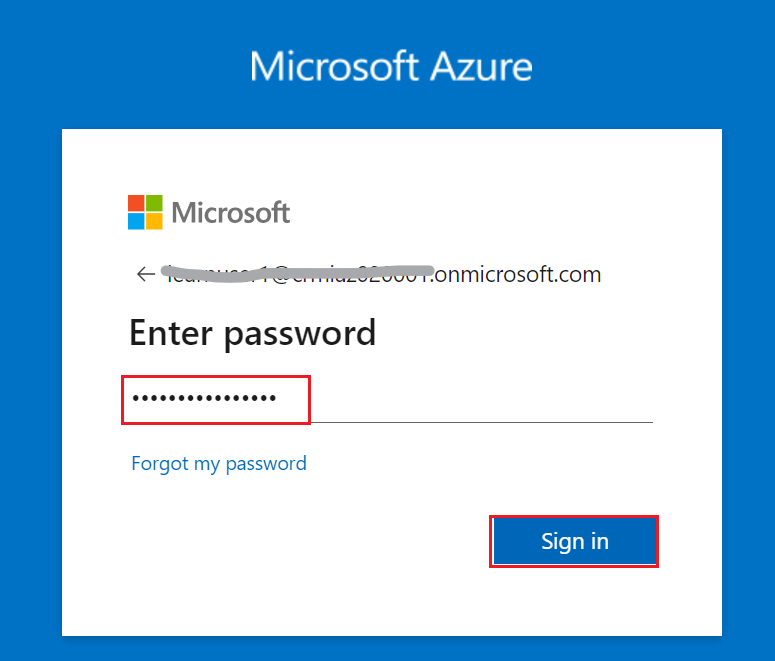

# Lab 0: Setting up your Lab Environment

## Task 1: Redeem Azure Pass

1.  Open a new tab on your browser and browse to the **Microsoft Azure
    Pass** website using the given link
    !!https://www.microsoftazurepass.com/!!.

2.  Click on **Start**.

> 

3.  **Sign-in** with your **given Tenant** credentials.

4.  Verify your tenant’s email id and then click on **Confirm Microsoft
    Account**.

> 

5.  Paste the promo code in the **Enter Promo code** box and click
    **Submit**.

> 

6.  Enter the details in **Your Profile** page and select **I agree to
    the subscription agreement, offer details**, and then click **Sign
    up**.

***Note**: Make sure to give correct details. Incorrect details lead to
account deactivation.*

7.  Wait for the account setup to complete and then click on the
    **Submit** button.

8.  The account setup will take about 2-3 minutes to complete. It would
    automatically redirect you to the Azure Portal and now you are ready
    to use Azure services.

9.  Click **Subscriptions**.

10. You can check your subscription under the **Subscriptions** section.

## Task 2: Creating the user accounts

1.  Open your browser, navigate to the address bar, and type or paste
    the following URL: !!*https://portal.azure.com/!!*, then press the
    **Enter** button.

2.  In the **Microsoft Azure** window, use the **User Credentials** to
    login to Azure.

3.  Then, enter the password and click on the **Sign in** button**.**

> 

4.  In **Stay signed in?** window, click on the **Yes** button.

> 
>
> 

5.  On the Azure Portal and search for **Microsoft Entra ID.** Select
    the option from the list displayed accordingly.

> 

6.  On the left navigation pane, select the **Users** tab
    under **Manage** section.

> 

7.  To create a user drop down the **Add** and select **User** and click
    on the **Create new user.**

8.  Enter the **User Principal** Name as !!**chris**!!, enter the
    Display Name as !!**Chris Green**!!, and click on **'Next:
    Properties.**

> 

5.  Click on the **Next: Assignments.**

> 

6.  In the **Assignments** tab, select organizer and click on the
    **Review+submit**

> 
>
> 
>
> 

7.  In the **Review+submit** tab, once the Validation is Passed, click
    on the **Create** button.

> 

9.  You should see all the uploaded users under **All users** tab as
    shown in below image.

> 

## Task 3: Register the required resource providers

Your subscription must have the following resource providers registered:
**Microsoft.Purview**, **Microsoft.Storage**, **Microsoft.Synapse**,
**Microsoft.EventHub** and **Microsoft.Sql**. Follow the steps given
below to complete the registration.

1.  On the **Home** page of the Azure Portal, Click **Subscriptions**.

> 

2.  Select the Azure subscription which you have activated in Task 1.

> 

3.  Select **Resource providers** under the **Settings** section in the
    left pane.

> 

4.  Search for **Microsoft.Purview** service and click **Register.** It
    will take around 2-3 minutes to complete the registration. You can
    **Refresh** the view to see the status.

> 
>
> 

5.  In a similar way, search for and register **Microsoft.Storage**,
    **Microsoft.Synapse**, **Microsoft.EventHub,** **Microsoft.Sql,**
    **Microsoft.DataFactory,** **Microsoft.Insights** and
    **Microsoft.KeyVault** resources also.

    1.  **!!Microsoft.Storage!!** resource

> 

2.  **!!Microsoft.Synapse!!** resource

> 

3.  **!!Microsoft.EventHub!!** resource

4.  **!!Microsoft.Sql!!** resource

5.  **!!Microsoft.DataFactory!!** resource

6.  **!!Microsoft.Insights!!** resource

7.  **!!Microsoft.KeyVault!!** resource

## Task 2: Lab Environment Setup

1.  Open a new tab on your browser and browse to the given link to open
    the **Custom Deployment page**. **!!**
    **https://portal.azure.com/#create/Microsoft.Template/uri/https%3A%2F%2Fraw.githubusercontent.com%2Ftayganr%2Fpurviewlab%2Fmain%2Ftemplate%2Fazuredeploy.json!!**.

2.  Select **Build your own template in the editor**.

3.  On your lab VM, go to **C:\\labfiles**. Open **azuredeploy.json**
    using **Notepad** and copy the whole contents.

4.  Go to the Azure portal custom deployment page and paste the content
    in the editor. Select **Save**.

5.  Make sure that your **Azure Subscription** is selected automatically
    in the **Subscription** field.

 

6.  In the **Resource group** field, click **Create new.** Provide
    **!!purviewlab-rg!!** as the name of your resource group, and then
    select **OK**.

 

Note: Select available a region, in this lab **West US** is using for
this resource.

7.  Select **West US** for the **Region** field, and then
    click **Review + create**.

8.  Once the validation has passed, click **Create**.

9.  The deployment should take approximately 10 minutes to complete.
    Once you see the message **Your deployment is complete**, click **Go
    to resource group**.

10. If successful, you should see a set of 15 resources, like the
    screenshot below.

> 

Stay on the page and move on to the next part.

## Task 3: Save your credits

You can save your credits by stopping the Virtual Machine resource when
you are not using it.

1.  Select the **purviewlab-rg** group. Select the **Virtual Machine**
    resource.

2.  Click **Stop** and then click **OK**.

3.  Make sure that the Virtual Machine resource is stopped.

4.  You can click the **Start** tab when you want to use the Virtual
    Machine resource again.

