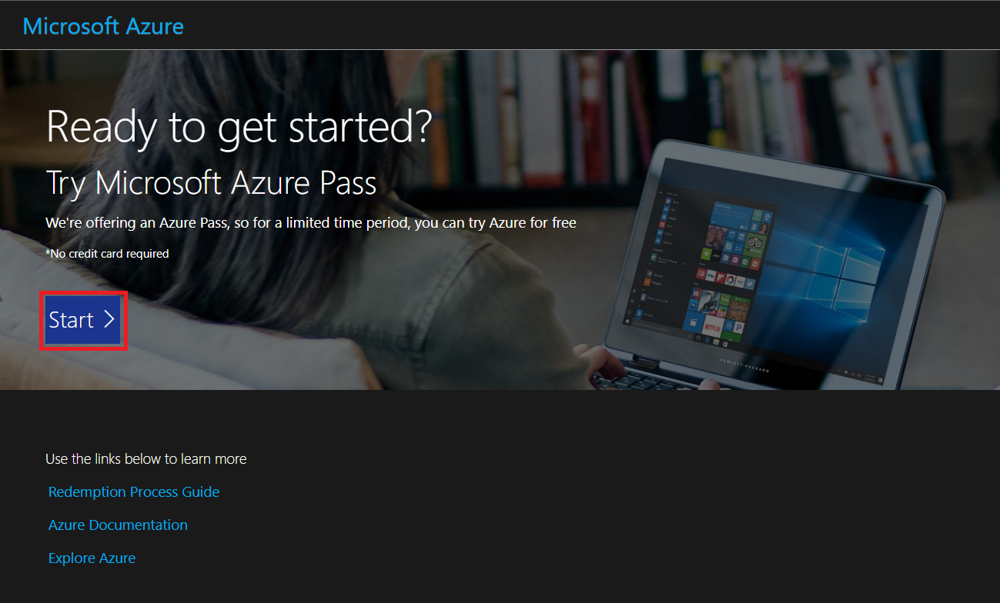
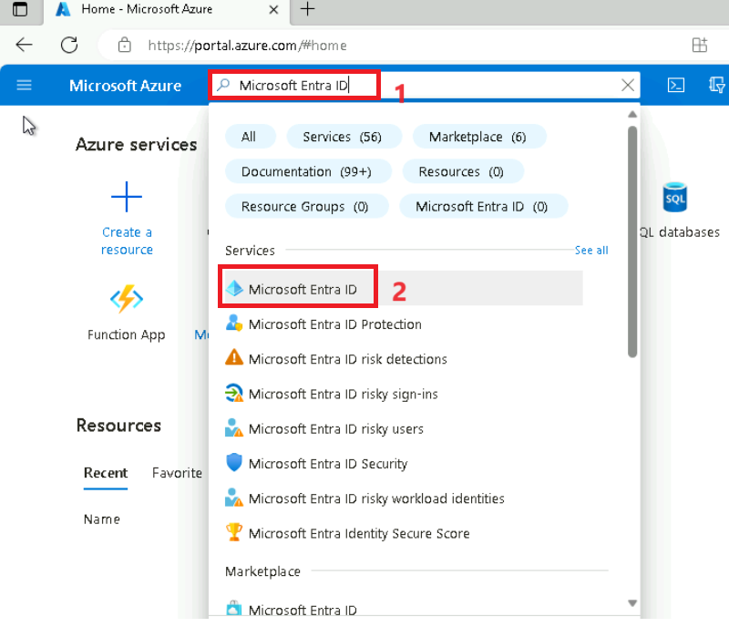

# Lab 0: Setting up your Lab Environment

## Exercise 1: Redeem Azure Pass

1.  Open a new tab on your browser and browse to the **Microsoft Azure
    Pass** website using the given link
    <https://www.microsoftazurepass.com/>.

2.  Click on **Start**.

3.  **Sign-in** with your **Office 365 Tenant** credentials.

4.  Verify your tenant’s email id and then click on **Confirm Microsoft
    Account**.

5.  Paste the promo code in the **Enter Promo code** box and click
    **Submit**.

6.  Enter the details in **Your Profile** page and select **I agree to
    the subscription agreement, offer details**, and then click **Sign
    up**.

***Note**: Make sure to give correct details. Incorrect details lead to
account deactivation.*

7.  Wait for the account setup to complete and then click on the
    **Submit** button.

8.  The account setup will take about 2-3 minutes to complete. It would
    automatically redirect you to the Azure Portal and now you are ready
    to use Azure services.

9.  Click **Subscriptions**.

10. You can check your subscription under the **Subscriptions** section.

## Task 2: Creating the user accounts

1.  On the Azure Portal and search for **Microsoft Entra ID.** Select
    the option from the list displayed accordingly.

> 

2.  On the left navigation pane, select the **Users** tab
    under **Manage** section.

3.  Click on **Bulk operations** and select **Bulk create**.

4.  Click on **Download** button to download
    the **UserCreateTemplate.csv** file.

5.  Open the downloaded **UserCreateTemplate.csv** file
    with **Notepad**.

6.  Update the **UserCreateTemplate.csv** file with below data for
    mandatory fields.

[TABLE]

7.  Make sure to have the proper sequence of comma delimiters for fields
    with no values.

8.  For the email id, make sure you give the domain id from your
    **Office 365 tenant credentials**.

9.  **Save** the file.

10. Click on **Upload** and upload the **UserCreateTemplate.csv** file.

11. Click on **Submit** after file is successfully uploaded without any
    errors.

**Note**: If there are errors, you must fix them before submitting the
job.

9.  You should see all the uploaded users under **All users** tab as
    shown in below image.

**Note**: The users accounts created above will be used in the upcoming
labs.

## Task 3: Register the required resource providers

Your subscription must have the following resource providers registered:
**Microsoft.Purview**, **Microsoft.Storage**, **Microsoft.Synapse**,
**Microsoft.EventHub** and **Microsoft.Sql**. Follow the steps given
below to complete the registration.

1.  On the **Home** page of the Azure Portal, Click **Subscriptions**.

2.  Select the Azure subscription which you have activated in Exercise
    1.

3.  Select **Resource providers** under the **Settings** section in the
    left pane.

4.  Search for **Microsoft.Purview** service and click **Register.** It
    will take around 2-3 minutes to complete the registration. You can
    **Refresh** the view to see the status.

5.  In a similar way, search for and register **Microsoft.Storage**,
    **Microsoft.Synapse**, **Microsoft.EventHub** and **Microsoft.Sql**
    resources also.

    1.  **Microsoft.Storage** resource

2.  **Microsoft.Synapse** resource

3.  **Microsoft.EventHub** resource

4.  **Microsoft.Sql** resource

