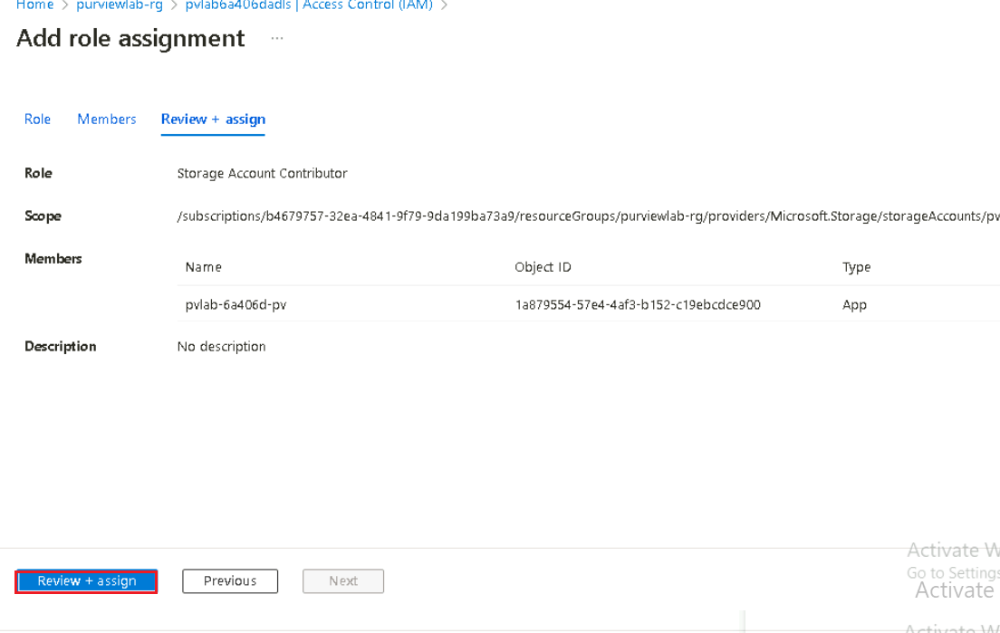
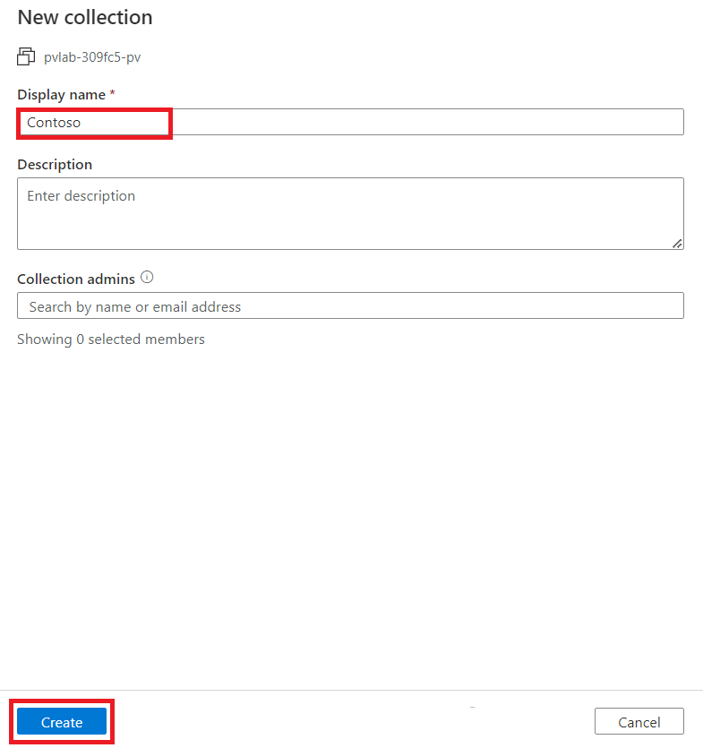

# Lab 2 - Registering & Scanning (ADLS Gen2 and Azure SQL DB)

## Exercise 1: Register & Scan ADLS Gen2 account

In this module, you'll walk through how to register and scan data
sources. You'll create a new collection for your first data source,
upload data and configure scanning. By the end of this module you'll
have technical metadata, such as schema information, stored in Purview.
You can use this to start linking to business terms, allowing your team
members to easier find data.

### Task 1: Grant the Microsoft Purview Managed Identity Access

In this module we will walk through how to grant the Microsoft Purview
system-assigned managed identity the necessary access to successfully
configure and run a scan.

1.  Navigate to the **Home** tab of Azure portal and select **All
    resources**.

2.  Select your **Azure Data Lake Storage Gen2 account**
    (e.g. pvlab{randomId}adls).

3.  Select **Access Control (IAM)** from the left navigation menu.

4.  Click **+ Add** and then click **Add role assignment**.

5.  Filter the list of roles by searching for **Storage Blob Data
    Reader**, click the row to select the role, and then click **Next**.

6.  Under **Assign access to**, select **Managed identity**, click **+
    Select members**, select **Microsoft Purview account** from
    the **Managed Identity** drop-down menu, select the managed identity
    for your Microsoft Purview account (e.g. pvlab-{randomId}-pv),
    click **Select**. Finally, click **Review + assign**.

7.  Click **Review + assign** once more to perform the role assignment.

8.  Select **Review + assign** again.

9.  To confirm the role has been assigned, navigate to the **Role
    assignments**. You should be able to see that the Microsoft Purview
    managed identity has been granted the **Storage Blob Data
    Reader** role.

10. Select **Access Control (IAM)** from the left navigation menu.

11. Click **+ Add** and then click **Add role assignment**.

12. Filter the list of roles by searching for **Storage Account
    Contributor** , click the row to select the role, and then
    click **Next**.

13. Under **Assign access to**, click **+ Select members**,
    select **Microsoft Purview account** from for your Microsoft Purview
    account (e.g. pvlab-{randomId}-pv), click **Select**. Finally,
    click **Review + assign**.

14. Click **Review + assign** once more to perform the role assignment.

15. You will see a notification – added as Storage Account Contributor
    for pvlab-{randomID}-pv

### Task 2: Upload Data to Azure Data Lake Storage Gen2 Account

Before proceeding with the following steps, you will need to:

#### Step 1: Download and install Azure Storage Explorer

1.  Open a new tab on your browser and browse to the given link
    <https://azure.microsoft.com/en-us/products/storage/storage-explorer/>.

2.  Select your **Operating system**.

3.  Open the downloaded setup of Azure Storage Explorer. Accept the
    agreement.

4.  To install **.NET 6** select **Next**.

5.  Browse the **Destination Location**. Select **Next**.

6.  Browse the **Start Menu Folder**. Select **Next**.

7.  On completing the setup, select **Finish**.

8.  Select **Sign in with Azure**.

9.  On the **Select Azure Environment** page, select **Azure** and then
    select **Next**.

10. Sign in with your **Office 365 Admi Tenant** credentials.

11. On completing the authentication, return to the **Azure Storage
    Explorer**.

12. On **Azure Storage Explorer**, you should verify that your Azure
    account has been added successfully.

#### Step 2: Upload a copy of Bing Coronavirus Query Set on Azure Storage Explorer

1.  Open Azure Storage Explorer, click on the **Toggle Explorer** icon,
    expand the Azure Subscription to find your Azure Storage Account
    (ADLS Gen2). Right-click on Blob Containers and select **Create Blob
    Container**.

2.  Name the container **raw**.

3.  With the container name selected, click on the **Upload** button,
    and select **Upload Folder...**.

4.  Click on the **ellipsis** to select a folder.

5.  Navigate and select **BingCoronavirusQuerySet** folder from
    **C:\LabFiles** and click on the **Select Folder** button.

6.  Click **Upload**.

7.  Monitor the **Activities** until the transfer is complete.

### Task 3: Create a Collection

1.  Navigate back to the **Home** tab of Azure portal and select **All
    resources**.

2.  Open the **Microsoft Purview account** **(pvlab-RandomId-pv)**.

3.  Open the **Microsoft Purview Governance Portal**.

4.  Navigate to **Data Map** \> **Domains** and click **+ New
    collection**.

5.  Enter !!**Contoso!!** in the **Display name** field and
    click **Create**.

### Task 4: Register a Source (ADLS Gen2)

1.  On the **Microsoft Purview Governance Portal**, navigate to **Data
    Map** \> **Data Sources**, and click on **Register**.

2.  Search for Data Lake, select **Azure Data Lake Storage Gen2**, and
    click **Continue**.

3.  Select the **Azure subscription**, **Storage account
    name**, **Collection**, and click **Register**.

### Task 5: Scan a Source with the Microsoft Purview Managed Identity

1.  On the **Microsoft Purview Governance Portal**, navigate to **Data
    Map** \> **Data Sources**, and within the **Azure Data Lake Storage
    Gen2** tile, click the **New Scan** button.

2.  Click **Test connection** to ensure the Microsoft Purview managed
    identity has the appropriate level of access to read the Azure Data
    Lake Storage Gen2 account. If successful, click **Continue**.

3.  Expand the hierarchy to see which assets will be within the scans
    scope, and click **Continue**.

4.  Select the system default scan rule set and click **Continue**.

5.  Select **Once** and click **Continue**.

6.  Click **Save and Run**.

7.  To monitor the progress of the scan run, click **View Details**.

8.  Click **Refresh** to periodically update the status of the scan.
    Note: It will take approximately 5 to 10 minutes to complete.

### Task 6: View Assets

1.  On the **Microsoft Purview Governance Portal** select **Data
    catalog**. On the **Home** tab perform a wildcard search by typing
    the asterisk character (\*) into the search box and hitting the
    Enter key to submit the query.

2.  You should be able to see a list of assets within the search
    results, which is a result of the scan.

## Exercise 2: Register & Scan Azure SQL DB account

In this exercise, you'll walk through how to register and scan data
sources. You'll create a new collection for your first data source,
upload data and configure scanning. By the end of this exercise you'll
have technical metadata, such as schema information, stored in Purview.
You can use this to start linking to business terms, allowing your team
members to find data more easily.

### Task 1: Key Vault Access Policy \#1 (Grant Yourself Access)

1.  Navigate to the **Home** tab of Azure portal and select **All
    resources**.

2.  Select your **Azure Key Vault** resource (Eg. Pvlab
    {RandomId}-keyvault).

3.  Select **Access policies** and click **+ Create**.

4.  Under **Secret permissions**, click **Select all**. Then,
    click **Next**.

5.  Search for your **account name**, select your account name from the
    search results, then click **Next**.

6.  Skip the **Application (optional)** page by clicking **Next** again.

7.  Review your selections then click **Create**.

### Task 2: Key Vault Access Policy \#2 (Grant Microsoft Purview Access)

In this next step, we are creating a second access policy which will
provide Microsoft Purview the necessary access to retrieve secrets from
the Key Vault.

1.  Select **Access policies** again and click **+ Create**.

2.  Under **Secret permissions**, select **Get** and **List**. Then,
    click **Next**.

3.  Search for the name of your Microsoft Purview account
    (e.g. pvlab-{randomID}-pv), select the item, then click **Next**.

4.  Skip the **Application (optional)** page by clicking **Next** again.

5.  Review your selections then click **Create**.

### Task 3: Generate a Secret

In order to securely store our Azure SQL Database password, we need to
generate a secret.

1.  Navigate to **Secrets** and click **Generate/Import**.

2.  **Copy** and **paste** the values below into the matching fields and
    then click **Create**.

> **Name - sql-secret**
>
> **Value - sqlPassword!**

### Task 4: Add Credentials to Microsoft Purview

To make the secret accessible to Microsoft Purview, we must first
establish a connection to Azure Key Vault.

1.  Navigate back to the **Home** tab of Azure portal and select **All
    resources**.

2.  Open the **Microsoft Purview account** **(pvlab-RandomId-pv)**.

3.  Open the **Microsoft Purview Governance Portal**.

4.  Navigate to **Management Center** \> **Credentials**, click **Manage
    Key Vault connections**.

5.  Click **New**.

6.  **Copy** and **paste** the value below to set the name of your **Key
    Vault connection**, and then use the drop-down menu items to select
    the appropriate **domain**, **Subscription** and **Key Vault name**,
    then click **Create**.

> **Name – KeyVault01**

7.  Since we have already granted the Microsoft Purview managed identity
    access to our Azure Key Vault, click **Confirm**.

8.  Click **Close**.

9.  Under **Credentials** click **New**.

10. Using the drop-down menu items, set the **Authentication
    method** to SQL authentication and the **Key Vault connection** to
    KeyVault01. Once the drop-down menu items are
    set, **Copy** and **paste** the values below into the matching
    fields, and then click **Create**.

- **Name - credential-SQL**

- **User name - sqladmin**

- **Secret name - sql-secret**

### Task 5: Register a Source (Azure SQL DB)

1.  On the **Microsoft Purview Governance Portal**, navigate to **Data
    map** \> **Data Sources**, and click **Register**.

2.  Search for SQL Database, select **Azure SQL Database**, and
    click **Continue**.

3.  Select the **Azure subscription**, **Server name
    (pvlab-RandomId-sqlsvr)**, and **Collection
    (pvlab-RandomId-pv\>Contoso)**. Click **Register**.

### Task 6: Scan a Source with Azure Key Vault Credentials

1.  On the **Microsoft Purview Governance Portal**, navigate to **Data
    map** \> **Sources**, and within the Azure SQL Database tile, click
    the **New Scan** button.

2.  Select your **Database** (e.g. pvlab-{randomID}-sqldb), set
    the **Credential** to **credential-SQL**, turn **Lineage
    extraction** to **Off**, and click **Test connection**. Once the
    connection test is successful, click **Continue**.

> ***Note***
>
> *If the "Test connection" appears to be hanging, click Cancel and
> re-try.*

3.  Click **Continue**.

4.  Click **Continue**.

5.  Set the trigger to **Once**, click **Continue**.

6.  Click **Save and Run**.

7.  To monitor the progress of the scan, click **View Details**.

8.  Click **Refresh** to periodically update the status of the scan.

> ***Note***
>
> *It will take approximately 5 to 10 minutes to complete.*

### Task 7: View Assets

1.  On the **Microsoft Purview Governance Portal** select **Data
    catalog**. On the **Home** tab perform a wildcard search by typing
    the asterisk character (\*) into the search box and hitting the
    Enter key to submit the query.

2.  You should be able to see a list of assets within the search
    results, which is a result of the scan.

