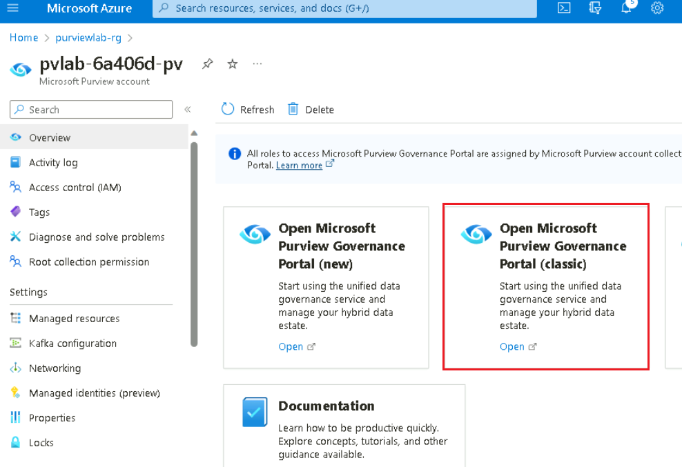
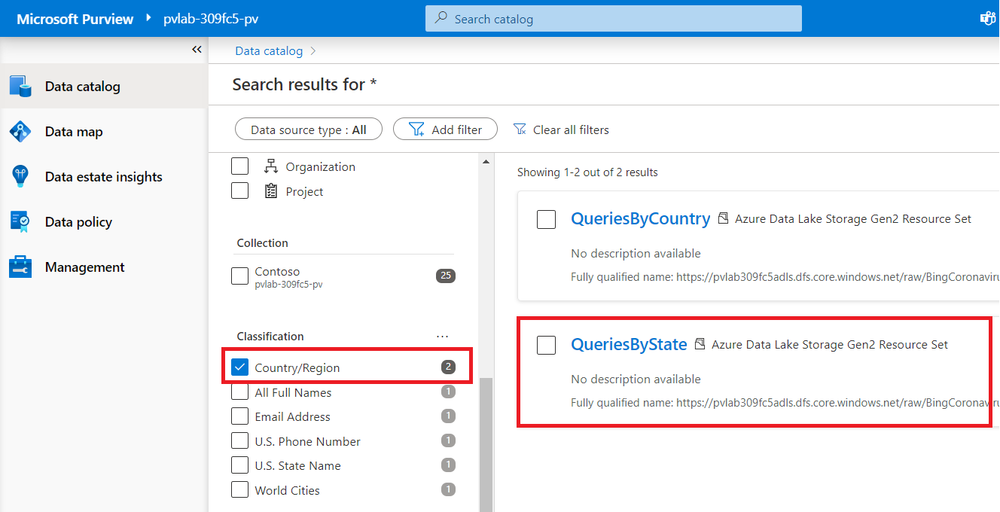
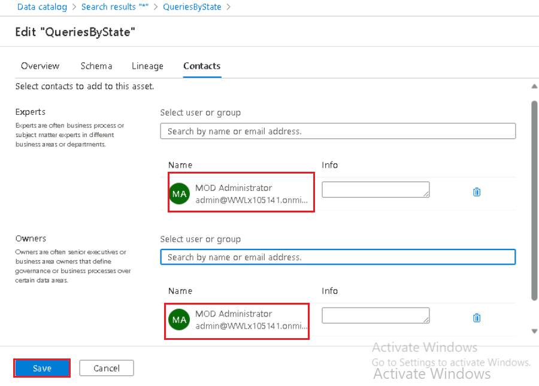
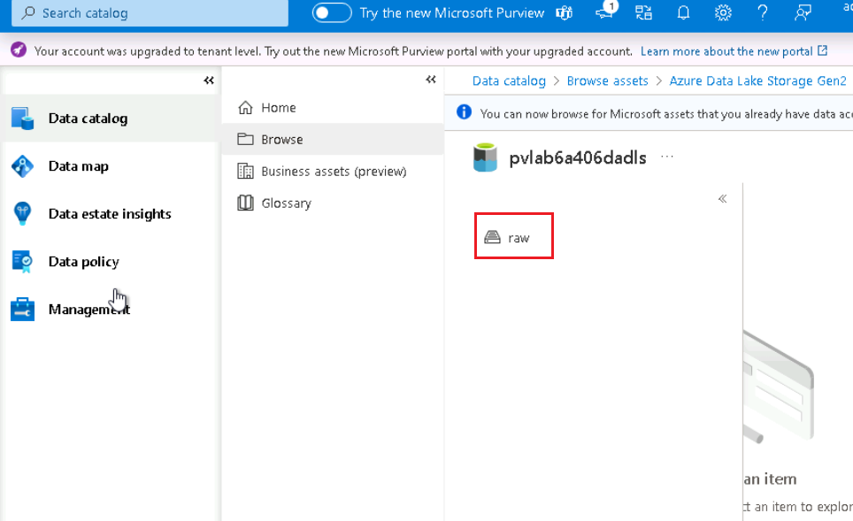
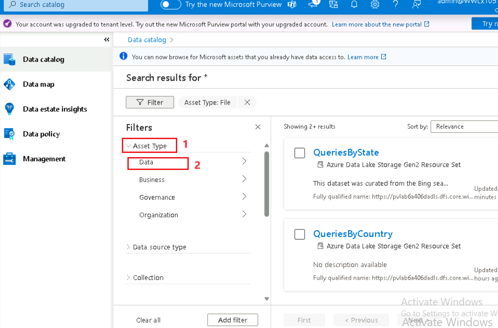

# Lab 3 - Search the Microsoft Purview Data Catalog

In this lab, you'll learn to edit technical metadata by adding
definitions and classifications to data attributes, such as tables and
columns. You'll learn to assign technical ownership by linking technical
attributes to contact persons. You'll learn to use classifications to
mark data. All these activities, such as categorizing data, will help
you to better manage your data.

**Task 1. Search Catalog**

1.  Navigate to the **Home** tab of Azure portal and select **All
    resources**.

2.  Open the **Microsoft Purview account** **(pvlab-RandomId-pv)**.

3.  Open the **Microsoft Purview Governance Portal**.

4.  On the **Microsoft Purview Governance Portal**, navigate to **Data
    Catalog** \> **Home**, type the asterisk character (**\***) into the
    search bar, and hit **Enter**.

5.  Filter the search results
    by **Classification** (e.g. **Country/Region**) and click the
    hyperlinked asset name to view the details (e.g. QueriesByState).

## Task 2. Update an Asset

1.  Click **Edit** to modify the asset details.

2.  Update the **Description** by copying and pasting the sample text
    below.

> This dataset was curated from the Bing search logs (desktop users
> only) over the period of Jan 1st, 2020 – (Current Month - 1). Only
> searches that were issued many times by multiple users were included.
> The dataset includes queries from all over the world that had an
> intent related to the Coronavirus or Covid-19. In some cases this
> intent is explicit in the query itself (e.g., “Coronavirus updates
> Seattle”), in other cases it is implicit , e.g. “Shelter in place”

3.  Assign a **Classification** (e.g. World Cities) using the drop-down
    menu.

4.  Navigate to the **Schema** tab and update the **Asset
    description** for each column using the sample text below.

> **Date**
>
> Date on which the query was issued.
>
> **Query**
>
> The actual search query issued by user(s).
>
> **IsImplicitIntent**
>
> True if query did not mention covid or coronavirus or sarsncov2 (e.g,
> “Shelter in place”). False otherwise.
>
> **State**
>
> State from where the query was issued.
>
> **Country**
>
> Country from where the query was issued.
>
> **PopularityScore**
>
> Value between 1 and 100 inclusive. 1 indicates least popular query on
> the day/State/Country with Coronavirus intent, and 100 indicates the
> most popular query for the same geography on the same day.

5.  Navigate to the **Contacts** tab and set someone within your
    organization to be an **Expert** and an **Owner** (Provide your
    Office 365 Admin Tenant email-ID). Click **Save**.

6.  For assets in which you are tagged as a **Contact**, these will
    appear on the home screen (Data catalog), under **My items**.

7.  To see other assets within the same path, navigate to
    the **Related** tab.

### **Task 3: Browse the catalog by source**

While the search experience is ideal for keyword based discovery, the
Microsoft Purview Governance Portal allows alternate methods of browsing
assets (i.e. by collection OR by source type).

1.  On the **Microsoft Purview Governance Portal**, navigate to **Data
    Catalog** and click **Browse**.

2.  Switch to the **By source type** tab and select
    a **source** as **Azure Data Lake Storage Gen2**.

3.  Select the **pvlab{randomId}adls** storageaccount 

4.  Under the storage Select the **raw** container 

> 
>
> 

### **Task 4: Perform a Bulk Edit option**

Microsoft Purview allows us to perform certain operations
(add/replace/remove) against a subset of attributes (Expert, Owner,
Term, Classification) in bulk directly within the Microsoft Purview
Governance Portal.

1.  On the **Microsoft Purview Governance Portal**, navigate to **Data
    Catalog** \> **Home**, type the asterisk character (**\***) into the
    search bar, and hit **Enter**.

2.  On the **Data catalog** pane , under **Asset Type** select the
    **Data** and select  **File** and **Table**. select the first five
    items in the search results, and click **View selected**.

> 

3.  On the **Select assets** tab , Click **Bulk edit**.

4.  Set the **Attribute** to **Owner**, set **Operation** to **Add**,
    select your **Office 365 Admin Tenant** for New value, and
    click **Apply**.

5.  On the **Select assets** tab, Click **Deselect all and close**.

