# Lab 04 - Glossary

In this lab you learn how to create terms using a system and custom term
template. You'll also learn how to import and export terms. Lastly, you
learn about linking terms to data assets, which helps to relate
technical metadata to business metadata.

## Task 1: Create a Term in the Glossary using the System Default Term Template

1.  Open the **Microsoft Purview Governance Portal**.

2.   From the **Data catalog**, navigate to **Glossary**, and
    click **New glossary**.

3.  **Copy** and **paste** the values below into the appropriate fields,
    select your **Domain** and set your **Office 365 Admin Tenant** as
    the **Steward** and **Expert**, and click **Create**.

> **Name - Glossary**
>
> **Description -** A glossary is a vocabulary of business terms that
> can be mapped to assets like a database, tables, columns etc. Glossary
> terms can help establish a common language across the business,
> abstracting the technical jargon typically associated with data
> repositories.

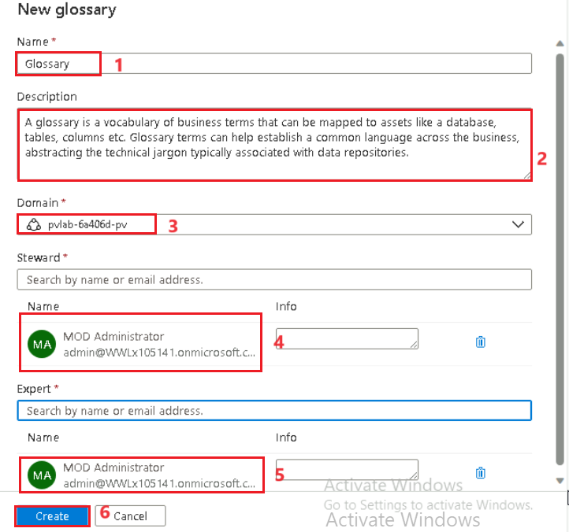

## Task 2. Create a Term (System Default Term Template)

1.  On the **Microsoft Purview Governance Portal** and from the **Data
    catalog**, navigate to **Glossary**, and select **Glossary**.

2.  Click **+ New term**.

3.  Select the **System default** term template and click **Continue**.

4.  Change the **Status** of the term to **Approved** and
    then **copy** and **paste** the values below into the appropriate
    field, then click **Create**.

> **Name - !!Contoso Parent!!**
>
> **Definition - !!This will be the parent term.!!**
>
> **Acronym - !!CP!!**
>
> **Resource Name - !!Microsoft Purview!!**
>
> **Resource Link - !\!<https://aka.ms/MicrosoftPurview>!!**

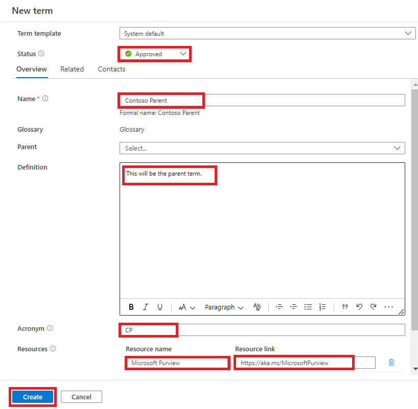

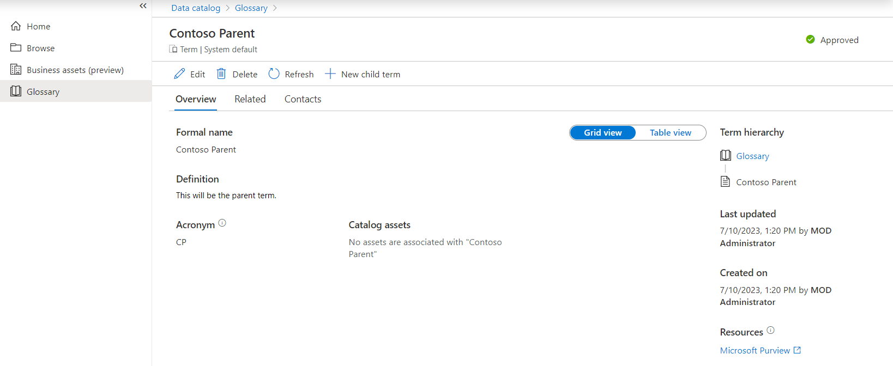

## Task 3. Create a Term (Custom Term Template)

1.  On the **Microsoft Purview Governance Portal** and from the **Data
    catalog**, navigate to **Glossary**, and select **Glossary**.

2.  On the **Glossary** pane, Click **+ New term**.

3.  On the New term tab, Click **+ New term template**.

4.  On the New term template tab, enter !!**Contoso Template!!** in the
    **Template name** field and click + **New attribute**.

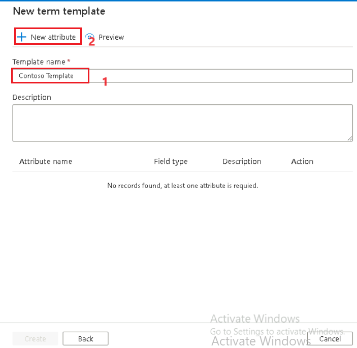

5.  On the New attribute tab, populate the attribute fields as per the
    examples below and click **Apply**.

[TABLE]

6.  On the New term template tab, Click **Create**.

7.  Now on the New term tab, select **Contoso Template** and
    click **Continue**.

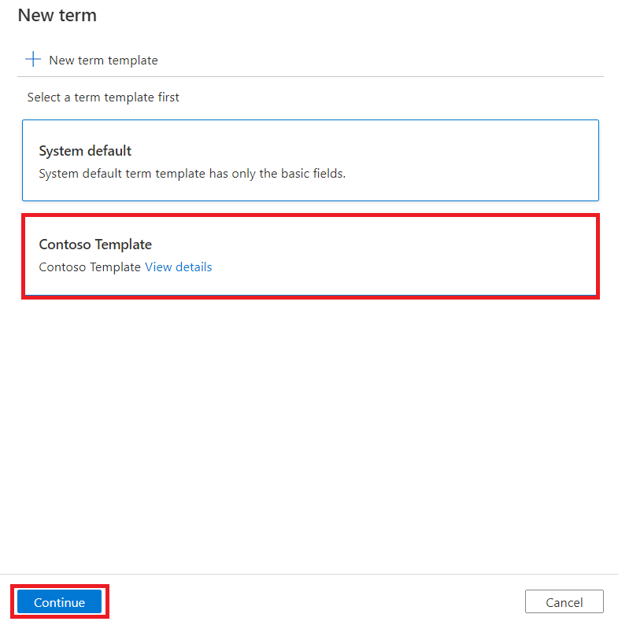

8.  Change the **Status** of the term to Approved and
    then **copy** and **paste** the values below into the appropriate
    field, then click **Create**.

> **Name - !!Contoso Child!!**
>
> **Definition - !!This will be the long description for the child
> glossary term.!!**
>
> **Parent -** Contoso Parent
>
> **Business Unit –** Marketing

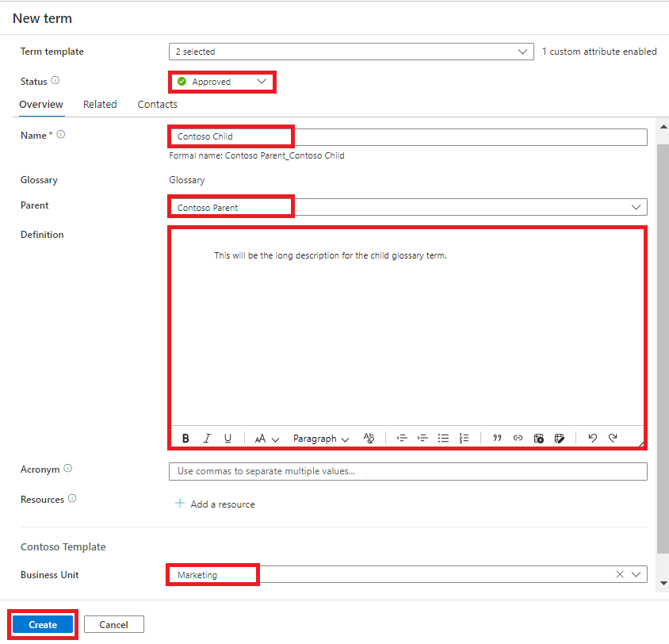

9.  From the **Glossary** screen, select **Terms**, then toggle the view
    to **Hierarchical view** to see the hierarchical glossary.

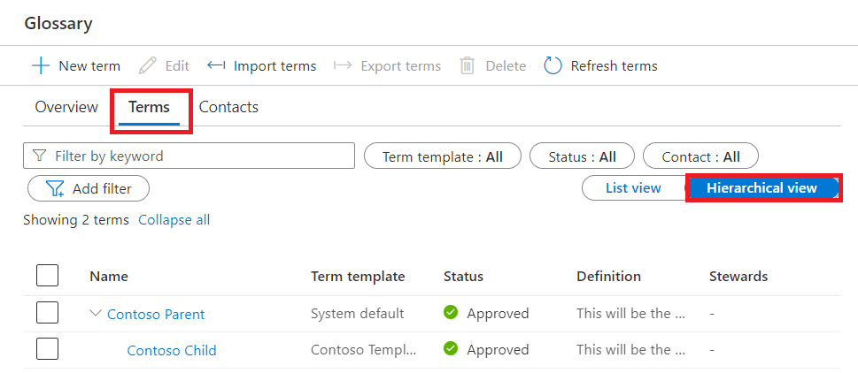

## Task 4. Bulk Import Terms

1.  From the **Glossary** screen, click **Import terms**.

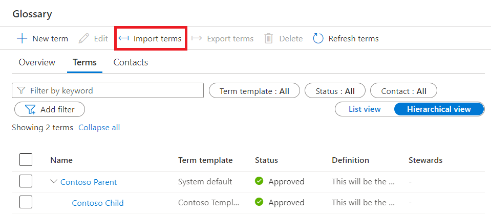

2.  Select the **System default** term template and click **Continue**.

3.  Click **Browse** and open the file **import-terms-sample.csv** from
    **C:\LabFiles** on your Lab VM.

4.  Click **OK**.

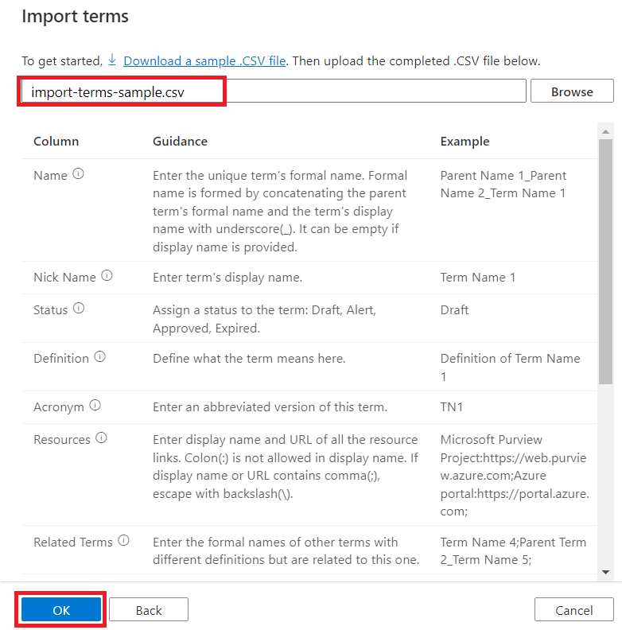

5.  Once complete, you should see 50 additional terms beneath the parent
    (Workplace Analytics). 

> ***Tip***
>
> *You can quickly find specific types of terms using the filters at the
> top (e.g. Status = Approved).*

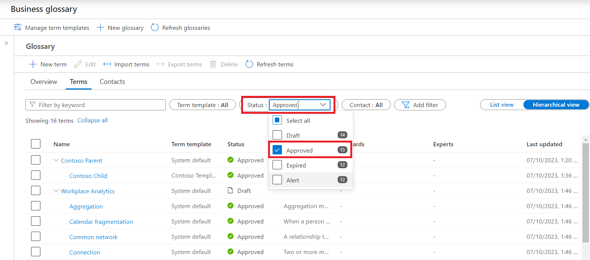

## Task 5. Bulk Export Terms

1.  From the **Glossary** screen, we want to select ALL terms (top check
    box) and then de-select terms that do not belong to Workplace
    Analytics (i.e. Contoso Parent, Contoso Child). **All Workplace
    Analytics terms** should be selected. Click **Export terms**.

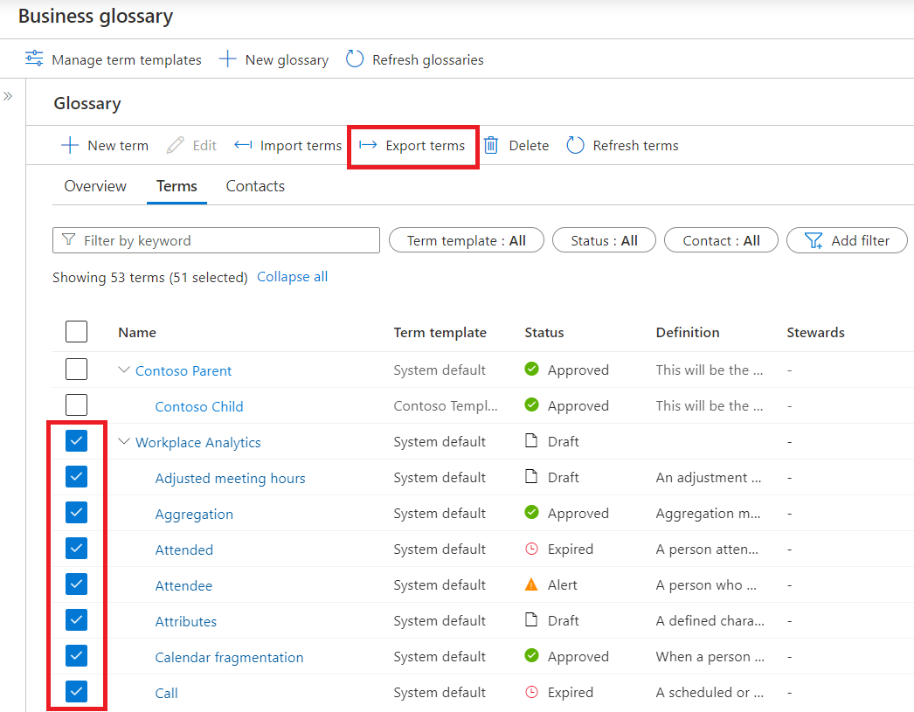

2.  If the export was successful, you should find a **CSV** file has
    been copied to your local machine (e.g. Downloads).

## Task 6. Assign a Term to an Asset

1.  On the **Microsoft Purview Governance Portal** and from the **Data
    catalog**, perform a wildcard search by typing asterisk (**\***)
    into the search bar and hitting the Enter key to submit the query.
    Click on an asset title (e.g. QueriesByState) to view the details.

2.  On **QueriesByState** pane, Click **Edit**.

3.  Open the **Glossary terms** drop-down menu and select a glossary
    term (e.g. Contoso Child). Click **Save**.

4.  Click on the hyperlinked term name to view the glossary term
    details.

5.  Click **Refresh** to view the **Catalog assets** the term is
    assigned to.

## Exercise 7. Update an Existing Term

1.  On the **Microsoft Purview Governance Portal** and from the **Data
    catalog**, navigate to **Glossary**, and select **Glossary**.

## 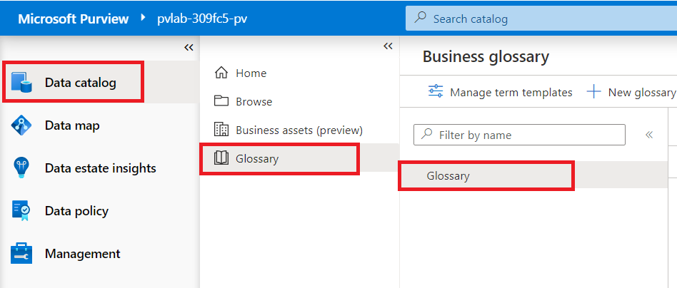

2.  From the **Glossary** screen, select **View terms**.

3.  On the Glossary pane, select an existing term called
    **Aggregation**.

4.  On Aggregation pane ,navigate to the **Related** tab and
    click **Edit**.

5.  Use the drop-down menu to assign two glossary terms as **Synonyms**
    (e.g. **Workspace Analytics \> Attended** and **Workspace Analytics
    \> Attendee**).

6.  Use the drop-down menu to assign two glossary terms as **Related
    terms** (e.g. **Workspace Analytics \> Collaborator group** and
    **Workspace Analytics \> Collaborators**).

7.  Navigate to the **Contacts** tab and assign your **Office 365 Admin
    Tenant** as an **Expert** and a **Steward**. Click **Save**.

