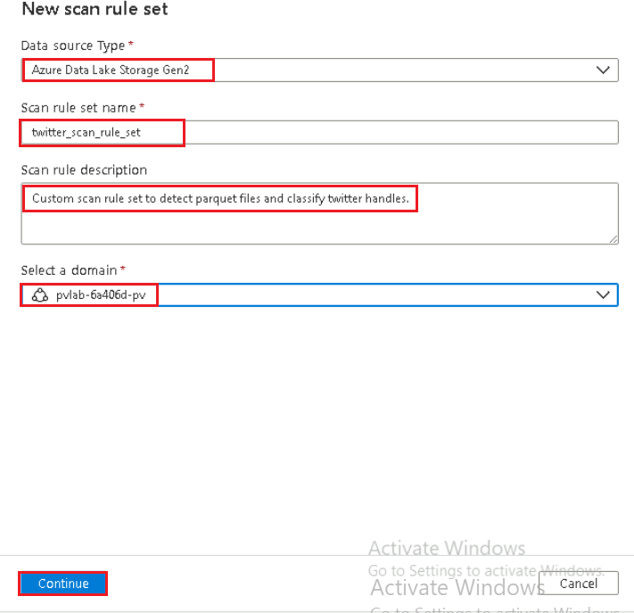
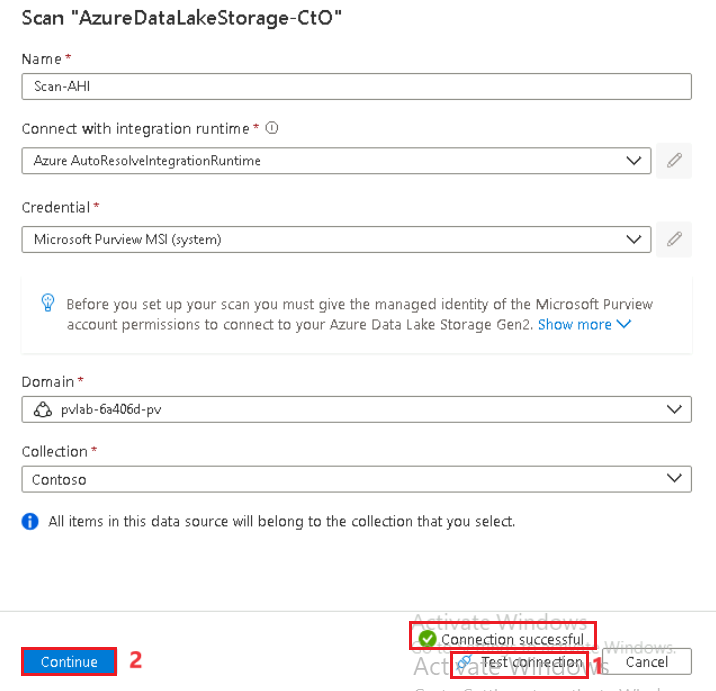
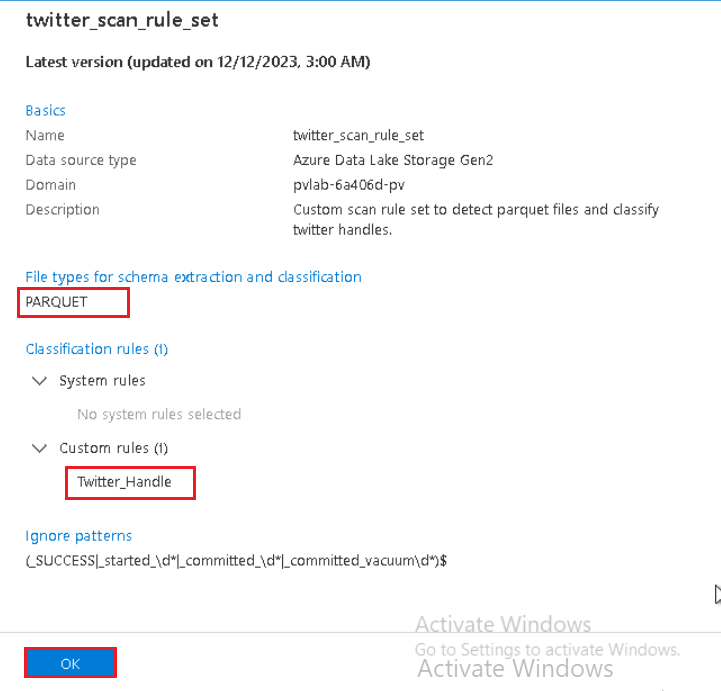
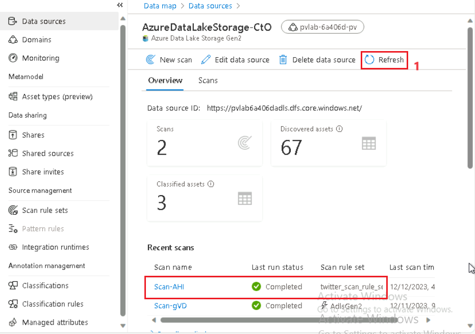
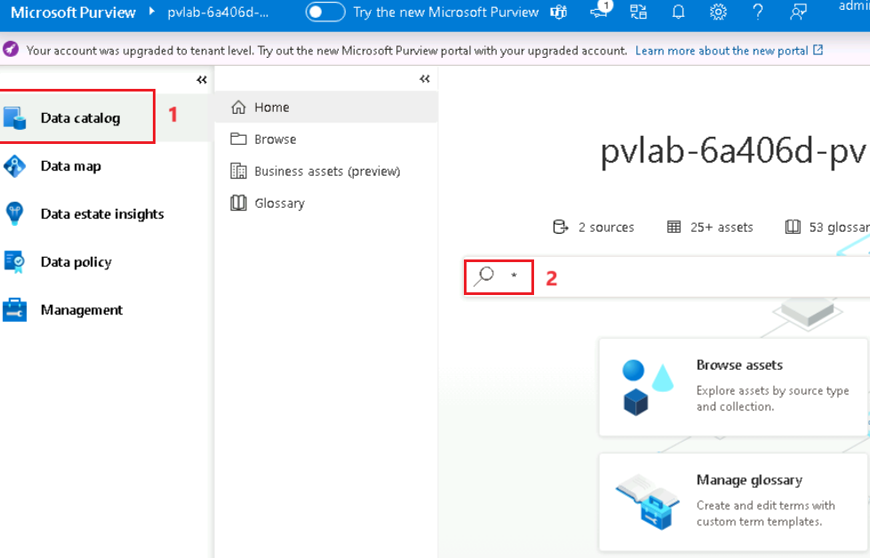

# Lab 05 – Creating a custom classification

## Task 1. Create a Classification

1.  Open the **Microsoft Purview Governance Portal**.

2.  Navigate to **Data map** \> **Classifications** (under Annotation
    management) and click **+** **New**.

3.  **Copy** and **paste** the values below into the appropriate fields
    and click **OK**.

> **Name - Twitter Handle**
>
> **Description - The username that appears at the end of your unique
> Twitter URL.**

4.  Navigate to the **Custom** tab to confirm the custom classification
    has been created.

## Task 2. Create a Custom Classification Rule (Regular Expression)

1.  Navigate to **Data map** \> **Classification rules** (under
    Annotation management) and click **+** **New**.

2.  Populate the classification rule fields as per the example below and
    click **Continue**.

[TABLE]

3.  Click the **Browse** icon and open the **twitter_handles.csv** file
    from **C:\LabFiles** on your Lab VM.

4.  Select the data pattern associated to the **Handle** column and
    click **Add to patterns**.

5.  Modify the **Data Pattern** by replacing the plus symbol (+) in the
    text with **{5,15}**.

    - The plus symbol (+) indicates one or more characters matching the
      preceding item. This may lead to false positives as it would allow
      for an unlimited number of alphanumeric characters. Twitter
      handles must be a minimum of 5 and a maximum of 15 characters.

    - With {5,15}, this will ensure matches only occur where there is a
      at least 5 and at most 15 occurrences of the preceding item.

6.  While we can also specify a **Column Pattern**, in this example we
    will rely solely on the Data Pattern. Clear the **Column
    Pattern** input and click **Create**.

## Task 3 : Create a Scan Rule Set

1.  Navigate to **Data map** \> **Scan rule sets** (under Source
    management) and click **+ New**.

2.  Change the **Source Type** to **Azure Data Lake Storage
    Gen2** then **copy** and **paste** the values below into the
    appropriate fields. Click **Continue**.

> **Scan rule set name - twitter_scan_rule_set**
>
> **Scan rule description - Custom scan rule set to detect parquet files
> and classify twitter handles.**

3.  Clear all file type selections except for **PARQUET** and
    click **Continue**.

4.  Clear all selected **System rules** and select the custom
    classification rule **twitter_handle** and click **Continue**.

5.  Click **Create**.

## Task 4: Upload Data to an Azure Data Lake Storage Gen2 Account

1.  Open **Microsoft Azure Storage Explorer**.

2.  Navigate to your **Azure Data Lake Storage Gen2 Account**,
    expand **Blob Containers**, and **Open** the **raw** container.

> ***Note***
>
> *If a raw container does not exist, create one.*

3.  Click on the **New Folder** button, provide **Twitter** as the
    folder name and click **OK**.

4.  Right-click on the newly created folder and click **Open**.

5.  Click on the **Upload** button and select **Upload Files...**.

6.  Click on the ellipses (…) to select the file.

7.  Select the **twitter_handles.parquet** file from **C:\LabFiles** on
    your Lab VM and click **Upload**.

### **Task 5:  Scan an Azure Data Lake Storage Gen2 Account**

1.  Open the **Microsoft Purview Governance Portal**, navigate to **Data
    map** \>** Data Sources** and click **New Scan** within the **Azure
    Data Lake Storage Gen2** tile.

2.  Click **Test connection** to ensure the credentials have access and
    click **Continue**.

3.  By default, Microsoft Purview will have the parent Azure Data Lake
    Storage Gen2 account selected and therefore include all paths in
    scope. To reduce the scope, deselect the parent and select
    the **Twitter** folder only. Click **Continue**.

4.  To validate the scope of the custom scan rule set, click **View
    detail**.

5.  Confirm that the custom scan rule set includes the **PARQUET** file
    type and the custom classification rule **twitter_handle**.
    Click **OK**.

6.  Select the custom scan rule set **twitter_scan_rule_set** and
    click **Continue**.

7.  Set the scan trigger to **Once** and click **Continue**.

8.  Click **Save and Run**.

9.  To view the progress of the scan, navigate to **Sources** and
    click **View details** on the **Azure Data Lake Storage Gen2** tile.

10. Periodically click **Refresh** to update the scan status
    until **Complete**.

> ***Note***
>
> *This will take approximately 5 to 10 minutes.*

### **Task 6: Search by Classification**

1.  Once the scan has complete, perform a wildcard search by typing in
    the asterisk character (**\***) into the search bar and hit Enter.

2.  Limit the search results by setting **Classification** within the
    filter panel to **Twitter Handle**. Click on the asset title
    (**twitter_handles.parquet**) to view the asset details.

3.  You will notice on the **Overview** tab that the schema includes the
    **Twitter Handle classification**. To identify which column has been
    classified, navigate to the **Schema** tab.

4.  Within the **Schema** tab we can see that **Account name** is the
    column that has been classified.

