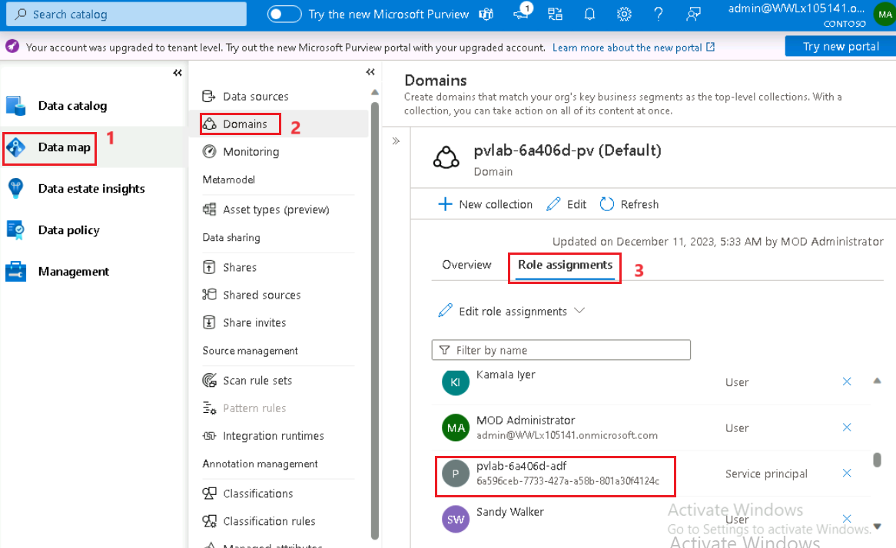

# Lab 06 – Lineage between datasets created by data processes

### **Task 1 :Create an Azure Data Factory Connection in Microsoft Purview**

1.  Open the **Microsoft Purview Governance Portal**.

2.  Navigate to **Management** \> **Data Factory** (under Lineage
    connections) and click **+ New**.

> ⚠️ To view/add/remove Data Factory connections, you need to be
> assigned the **Collection admin** role on the root collection.

3.  Select your **Azure Subscription**. Select your **Azure Data
    Factory** account instance from the drop-down menu
    (e.g. pvlab-{randomId}-adf) and click **OK**.

4.  Once finished, you should see the Data Factory in
    a **connected** state.

5.  To confirm that Azure Data Factory has been provided the necessary
    access, navigate to **Data
    map** \> **Domains** \>** pvlab-RandomId-pv \> Contoso** \> **Role
    assignments**, within **Data curators** you should be able to see
    the Azure Data Factory managed identity.

### **Task 2: Copy Data using Azure Data Factory Studio.**

1.  Navigate to the **Home** tab of Azure portal and select **All
    resources**.

2.  Switch to the **Azure Portal** tab and navigate to your **Azure Data
    Factory** resource (pvlab-{randomId}-adf).

3.  Click **Launch Studio** on the **Azure Data Factory Overview** page.

4.  Click **Ingest**.

5.  Select **Built-in copy task** and then click **Next**.

6.  Change the **Source type** to **Azure Data Lake Storage Gen2** and
    then click **+ New connection**.

7.  Select your **Azure subscription** and **Storage
    account** (e.g. pvlab{randomId}adls), click **Test connection** and
    then click **Create**.

8.  Click **Browse**.

9.  Navigate to **raw \> BingCoronavirusQuerySet \> 2020** and
    click **OK**.

10. Confirm your folder path selection and click **Next**.

11. Preview the sample data by clicking **Preview data**, and then
    click **Next**.

12. Change the **Destination type** to **Azure Data Lake Storage Gen2**,
    set the **Connection** to the existing connection
    (e.g. AzureDataLakeStorage1), and then click **Browse**.

13. Navigate to raw/ and click **OK**.

14. Confirm your folder path selection, set the **file
    name** to **2020_merged.parquet**, set the **copy
    behavior** to **Merge files**, and click **Next**.

15. Set the **file format** to **Parquet format** and click **Next**.

16. Leave the default settings and click **Next**.

17. Review the summary and proceed by clicking **Next**.

18. Once the deployment is complete, click **Finish**.

19. Navigate to the **Monitoring** screen to confirm the pipeline has
    run **successfully**.

### **Task 3: View Lineage in Microsoft Purview**

1.  Navigate to the **Microsoft Purview Governance Portal**, from
    the **Data catalog** screen click **Browse**.

2.  Switch to the **By source type** tab and then select **Azure Data
    Factory**.

3.  Select the **Azure Data Factory account
    instance** (e.g. pvlab-{randomId}-adf).

4.  Select the **Copy Pipeline** and click to open the **Copy
    Activity**.

5.  Navigate to the **Lineage** tab.

6.  You can see the lineage information has been automatically pushed
    from Azure Data Factory to Purview. On the left are the two sets of
    files that share a common schema in the source folder, the copy
    activity sits in the center, and the output file sits on the right.

