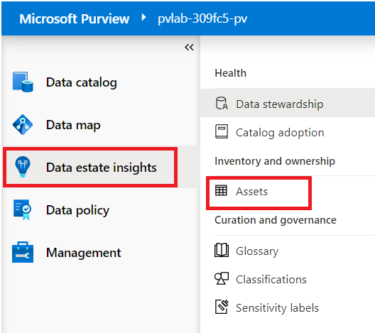

# Lab 07 – Understanding the different types of insights 

# **Note**: After you have scanned your source types, give asset insights 3-8 hours to reflect the new assets. The delay may be due to high traffic in deployment region or size of your workload.

**Introduction**

Insights are one of the key pillars of Purview. The feature provides
customers, a single pane of glass view into their catalog and further
aims to provide specific insights to the data source administrators,
business users, data stewards, data officer and security administrators.
Currently, Purview has the following Insights reports that will be
available to customers during Insight's public preview.

- Asset Insights

- Scan Insights

- Glossary Insights

- Classification Insights

- Sensitivity Labeling Insights

### **Task 1: Asset Insights**

View key metrics about your data estate's health and performance.

1.  Open the **Microsoft Purview Governance Portal**.

2.  Navigate to **Data estate insights** \> **Data stewardship**.

3.  The Data Stewardship page displays the following **high-level
    metrics**.

    - **Number of Assets by Curation Status**

    - **Number of Assets by Ownership Status**

    - **Number of Monthly Active Users**

4.  Further down the page you will find additional **data
    visualizations**, typically these tiles will allow interactive
    filtering and the ability to drill-down into the underlying detail
    by clicking **View details**. The Data Stewardship page includes the
    following **graphs**:

> **Data estate health**

> **Asset curation**

> **Trends and gap analysis**

## Task 2. Catalog adoption Insights

1.  On the **Microsoft Purview Governance Portal**, navigate to **Data
    estate insights** \> **Catalog adoption Insights**.

2.  The Catalog adoption page displays the following **graphs**:

> **Active users by feature category**

> **Most viewed assets**

> **Top searched keywords**

## Task 3: Assets Insights

View key metrics about your data estate's assets.

1.  On the **Microsoft Purview Governance Portal**, navigate to **Data
    estate insights** \> **Assets**.

2.  The Assets page displays the following **high-level metrics**.

    - **Number of Assets**

    - **Number of Assets by Classification Assignment Status**

    - **Number of Assets by Ownership Assignment Status**

    - **Number of New Assets (Last 30 days)**

    - **Number of Deleted Assets (Last 30 days)**

3.  The Assets page includes the following **graphs**:

> **Data assets by collection or source type**

> **Top file extensions**

## Task 4. Glossary Insights

View key metrics about glossary terms.

1.  Open the **Microsoft Purview Governance Portal**, navigate to **Data
    estate insights** \> **Glossary**.

2.  The Glossary page displays the following **high-level metrics**.

    - **Total Number of Terms**

    - **Total Number of Approved Terms without Assets**

    - **Total Number of Expired Terms with Assets**

3.  The Glossary page includes the following **graphs**:

> **Terms with and without assets**

> **Incomplete terms**

## Task 5. Classifications Insights

View key metrics about the classifications applied to sources, files,
and tables.

1.  Open the **Microsoft Purview Governance Portal**, navigate to **Data
    estate insights** \> **Classifications**.

2.  The Classifications page displays the following **high-level
    metrics**.

    - **Total Number of Classified Assets**

    - **Total Number of Files Classified**

    - **Total Number of Tables Classified**

    - **Total Number of Unique Classifications**

    - **Total Number of Sources Classified**

3.  The Classifications page includes the following **graphs**:

> **Top sources with classified data (last 30 days)**

> **Top classification categories**

> **Number of Files by Classification**

> **Number of Tables by Classification**

## Task 6. Sensitivity labels Insights

View key metrics about the sensitivity labels applied to sources, files,
and tables.

1.  Open the **Microsoft Purview Governance Portal**, navigate to **Data
    estate insights** \> **Sensitivity labels**.

2.  The Sensitivity Labels page displays the following **high-level
    metrics**.

    - **Total Number of Labeled Assets**

    - **Total Number of Labeled Files**

    - **Total Number of Labeled Tables**

    - **Total Number of Unique Labels**

    - **Total Number of Labeled Sources**

3.  The Sensitivity Labels page includes the following **graphs**:

> **Top sources with labeled data (last 30 days)**

> **Top labels applied across sources**

> **Number of Files by Label**

> **Number of Tables by Label**

Note: You can scan your data in Microsoft Purview to automatically apply
the labels you've created, based on the autolabeling rules you've
defined. Allow up to 24 hours for sensitivity label changes to reflect
in Purview.
