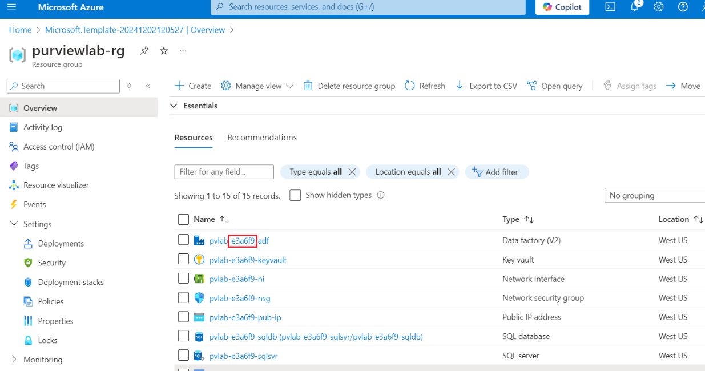
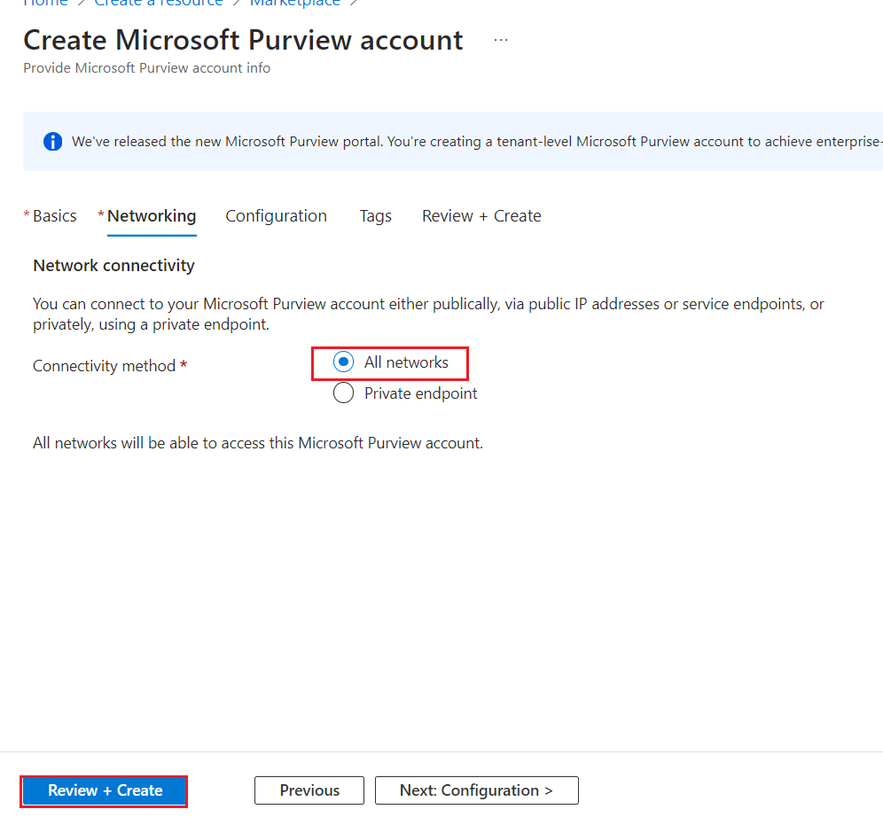
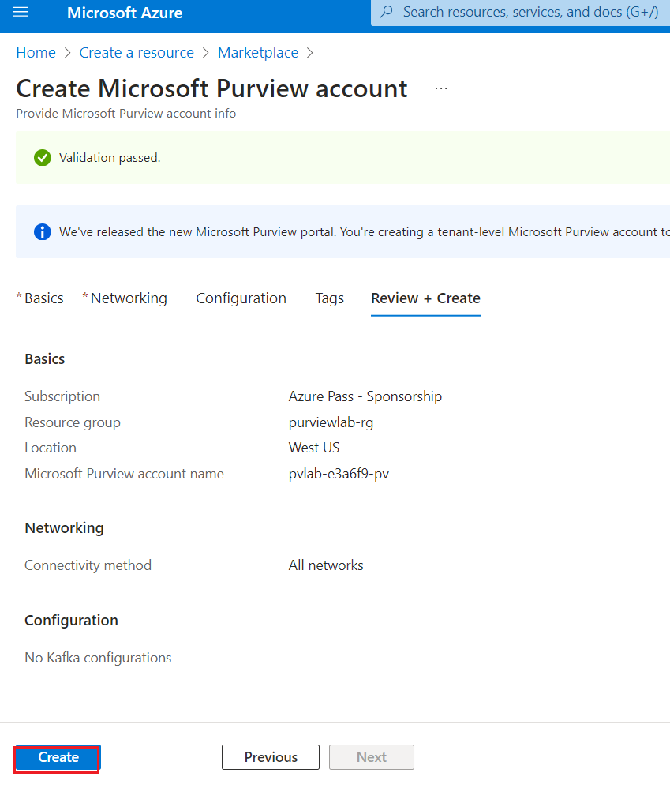

**Introduction**

Microsoft Purview is a unified data governance solution that helps you
manage and govern your data at large. It combines many different
services for scanning, collecting, organizing and sharing metadata. It
uses a catalogue for discoverability, but also offers other features,
such as automatic classification, sharing, access management and so on.

When planning your Microsoft Purview deployment, you first need to
provision a Microsoft Purview account. Next, you need to define your
collections for managing and grouping data assets together. A collection
is a logical container in which your metadata, such as data sources,
will be managed. When creating collections and placing them in a
hierarchy, you need to make different considerations, such as your
security requirements, governance structure and democratization needs.
For example, a more centralized-alined style of data management leads to
different collection structure then a more domain-oriented style of data
management. Depending on your needs, different topologies can be used
for managing your data

**Objectives**

- Create a Microsoft Purview account using the Azure portal.

- Provide additional users access to Microsoft Purview's data plane.

# Exercise 1: Create an Azure Purview Account

## **Task 1: Create an Azure Purview Account**

To create and use the Azure Purview platform, you will need to provision
an Azure Purview account.

1.  Sign in to the Azure portal <https://portal.azure.com/>, navigate to
    the **Home** screen, and then click **Create a resource**.

2.  Search the Marketplace for "**Microsoft Purview**" and
    click **Create**.

3.  Provide the inputs given below on the **Basics** tab.

> ***Note**:*
>
> *The Azure resources deployed using the lab template have a randomId.
> It is recommended to use the same randomId for the Microsoft Purview
> account name.*

[TABLE]

4.  Select **Review + Create**.

5.  On the **Review + Create** tab, once the message in the ribbon
    returns "**Validation passed**", verify your selections and
    click **Create**.

6.  Wait several minutes while your deployment is in progress. Once
    complete, click **Go to resource**.

Stay on the same page and continue to the next exercise.

## Task 2. Grant Access to Microsoft Purview's Data Plane

By default, the identity used to create the Microsoft Purview account
resource will have full access to the Microsoft Purview Governance
Portal. The following instructions detail how to provide access to
additional users within your Azure Active Directory.

1.  Navigate to your ***Microsoft Purview account***
    **(pvlab-{*randomId*}-pv)** and click the **Open Microsoft Purview
    Governance Portal** tile.

> 

2.  Select the checkbox near **This is a public preview. I agree to the
    preview section of the Product Terms C, and Privacy Statements**.
    And select **Get started**.

> 
>
> 

3.  In the **Purview** portal, select **Data map**.

4.  Select **Domains** under **Data Map** . On the Domains page,
    select **Role assignments** near **Overview**.

5.  Scroll down and on the right-hand side of **Data curators**, click
    the **add **icon.

> 

6.  Search for the user **!!Christie Cline!!** within your **Microsoft
    Entra ID** and select the **Account**. Then select **OK**.

> 

7.  The **Data Curator** role is now assigned to **Christie Cline** as
    well.

**Summary**

This lab provided an overview of how to provision a Microsoft Purview
account using the Azure Portal and how to grant the appropriate level of
access to Microsoft Purview's data plane.
