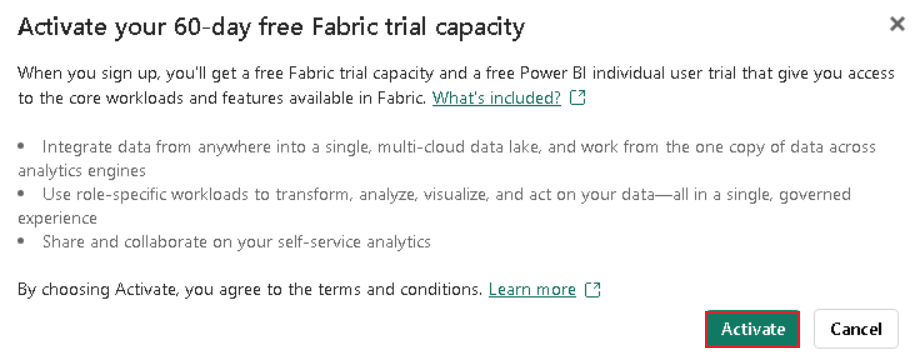
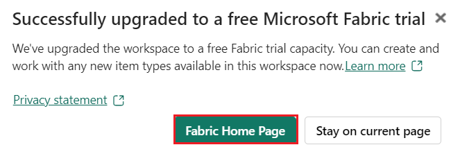
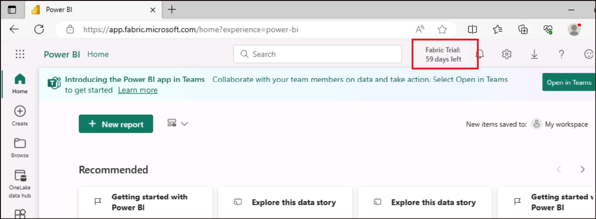
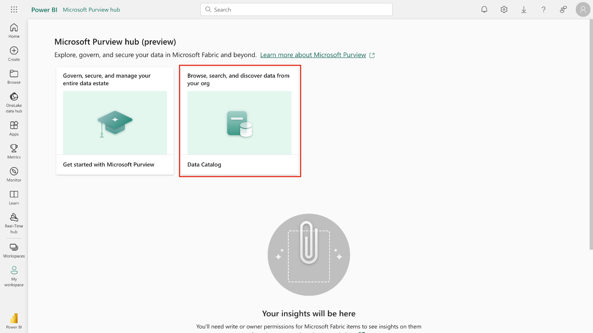
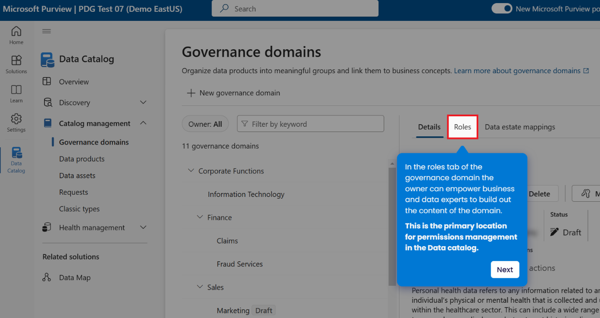
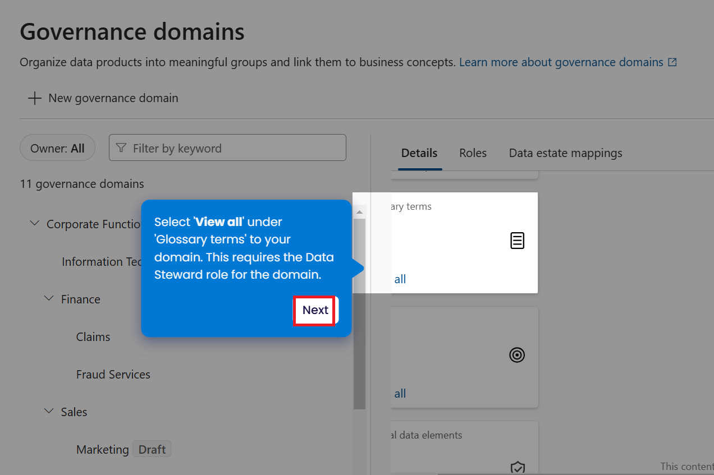
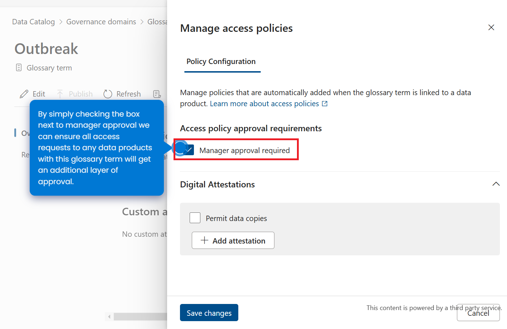

**Lab 10 – Govern data in Microsoft Fabric with Purview**

# Exercise 1: Sign in to Power BI account and sign up for the free [Microsoft Fabric trial](https://learn.microsoft.com/en-us/fabric/get-started/fabric-trial)

## Task 1: Sign in to Power BI account 

1.  Open your browser, navigate to the address bar, and type or paste
    the following URL: !!https://app.fabric.microsoft.com/!! then press
    the **Enter** button.

    

2.  In the **Microsoft Fabric** window, enter your assigned credentials
    and click on the **Submit** button.

     

3.  Enter the **Administrative password** from the **Resources** tab and
    click on the **Sign in** button**.**

     

4.  In **Stay signed in?** window, click on the **Yes** button.

5.  You’ll be directed to Power BI Home page.

     

## Task 2: Start the Microsoft Fabric trial

1.  On **Power BI Home** page, click on the **Account manager** icon on
    the top right corner of the page. In the Account manager blade,
    navigate and select **Start trial as shown in the below image.**

     

2.  On **Upgrade to a free Microsoft Fabric** trial dialog box, click on
    **Start trial button.**

     

3.  You will see a **Successfully upgraded to a free Microsoft Fabic
    trial** notification dialog box. In the dialog box, click on
    **Fabric Home Page** button.

    
 
    

# Exercise 2 – Setting up your business domains

To create business domains, glossary terms, define CDEs, and establish
OKRs follow the given steps.

1.  Open the !!https://app.powerbi.com/!!

2.  Sign in to the Power BI portal using the credentials provided with
    your lab environment.

3.  Select **Settings** \> **Microsoft Purview hub (preview)**.

    

4.  Select **Data Catalog**.

     

5.  You will be redirected to the new Microsoft Purview portal. If
    asked, agree to the terms and conditions and select **Get started**.

     

6.  Under **Getting started tutorial**  select **Set up governance
    domains.**
    

7.  If prompted to **Set up governance domains**, select **Let’s go!**.

     

8.  Select **Governance domains**.

     

9. Select +**New governance domain**

    

10. Select **Roles**

   

11. Select **Data Steward**.

    

12. Follow the rest of the click through tutorial and complete the
    exercise. Once the permissions are completed, select **Next**.

    

13. On the **Governance Domain prompt**, select **Next**.

    

14. Follow the rest of the click through tutorial and complete the
    exercise. You can hover on the blue dots to get the tooltips
    activated for more information on each step.

15. Once the Governance domains is created, select **Next**.

    

16. Under the Glossary terms select **+Create term**

     

17. Now select **Next**

     

18. In the **Glossary term pane**, under the **Outbreak** select
    **Manage policies**.

    

19. No select **Manager approval required**

     

20. Select **Next**

    

21. Select **+New OKR**

     

22. Select **Next**

     

     

23. Now Added an OKR ,select Next button.

     
     

24. In the Data Catalog pane, under Critical data elements select
    **+New**

     

25. Now ,select **Next**

     

26. Select +Add column

      

27. Select Next

     

28. In the Add columns tab , select **AgeGroupVacc**

     

28. Click on the **Publish**

     

     

Congratulations! You have successfully learned how to govern data in
Data catalog in Microsoft Purview.
