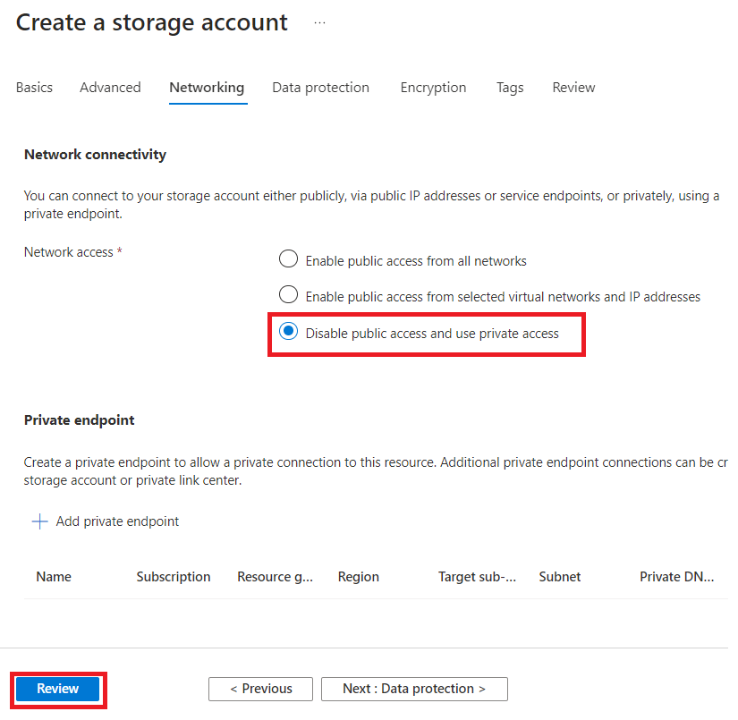

# Lab 11 - Securely scan sources using Self-Hosted Integration Runtimes

## Exercise 1. Storage account creation

1.  On the **Azure portal**, select **+ Create a resource**.

2.  Search for and select **Storage Account**.

3.  Click **Create**.

4.  Enter the following details and then select **Next: Advanced**.

[TABLE]

5.  On the **Advanced** tab, select the check box for **Enable
    hierarchical namespaces**. Click on **Next: Networking** tab.

6.  On the **Networking** tab, select **Disable public access and use
    private access** for **Network access** field. Click on **Review**.

7.  Select **Create**.

8.  When the deployment is completed, select **Go to resource**.

## Exercise 3. Private endpoint creation

Your next step is creating a private endpoint: a network interface that
uses a private IP address from your virtual network. This network
interface connects you privately and securely to your storage account.
It also means all network traffic is routed internally, which is useful
to mitigate network exfiltration risks.

1.  On your storage account **pvlabstorage**, select **Networking** from
    the left navigation. select **Private endpoints** and click on the
    **+ Private endpoint**.

2.  Enter **NewPrivateEndpoint** in the **Name** field and then select
    **Next: Resource** tab.

3.  On the **Resource** tab, select **blob** for **Target sub-resource**
    field and then select **Next: Virtual network**.

4.  On the **Virtual Network** tab, select the default values for
    **Virtual network** and **Subnet** fields, select **Dynamically
    allocate IP addresses** for **Private IP configuration** and then
    select **Next: DNS**.

5.  Accept the default settings on **DNS** tab and select **Next:
    Tags**.

6.  On the **Tags** tab, select **Next: Review + create**.

7.  On the **Review + create** tab, select **Create**.

## Exercise 4. Self-hosted integration runtime installation

A self-hosted integration runtime is a software component that scans for
metadata. You can install on many different types of (virtual) machines.
You can download it from the following
location: <https://www.microsoft.com/download/details.aspx?id=39717>

For this demo you will be using Windows 10. Open the Azure Portal again
to search for virtual machines.

1.  Create new and select Windows 10 Pro as the image version. Remember
    to enter a username and password. Click next to examine the network
    settings. The newly created virtual network using the 10.0.0.0 space
    should be selected here.

2.  After the virtual machine has been created, download the RDP file
    for easily taking over remote control.

3.  After downloading your RDP file, open it and enter your username and
    password from the previous section. If everything goes well, you
    should be connected and see the virtual machine’s desktop. To
    validate that your private endpoint works correctly, open CMD and
    type:

4.  nslookup storageaccountname.blob.core.windows.net

5.  If everything works correctly, the privatelink.blob.core.windows.net
    should show up in the list. This means is that your default access
    location has become an alias for an internal address. Although you
    use a public name, network is routed internally via the virtual
    network.

6.  When everything is working, you must download the self-hosted
    integration runtime package. The installation is straight forward.
    Just hit next and wait for the service to show up. While waiting,
    you should open Microsoft Purview. Open the data map and go to
    integration runtimes. Hit + new and select the self-hosted from the
    panel and continue.

7.  After completing the wizard, you see a link where you can download
    the latest version of the runtime. You also find two keys. Copy the
    first one to your clipboard.

8.  Next, go back to your virtual machine. Copy paste the link into the
    manager and hit ‘register’. Wait a minute or so, the integration
    runtime should show up in the list very soon!

9.  If everything works well your self-hosted integration runtime should
    be running within Purview. Congrats that you made it this far!
