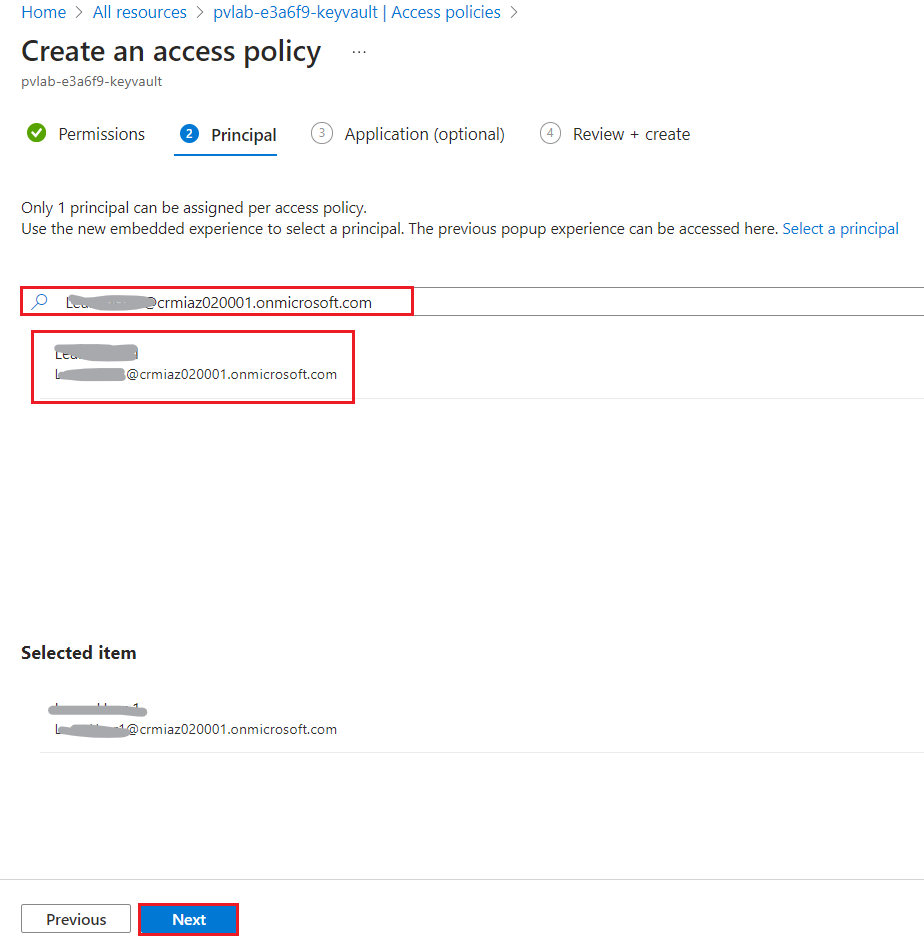
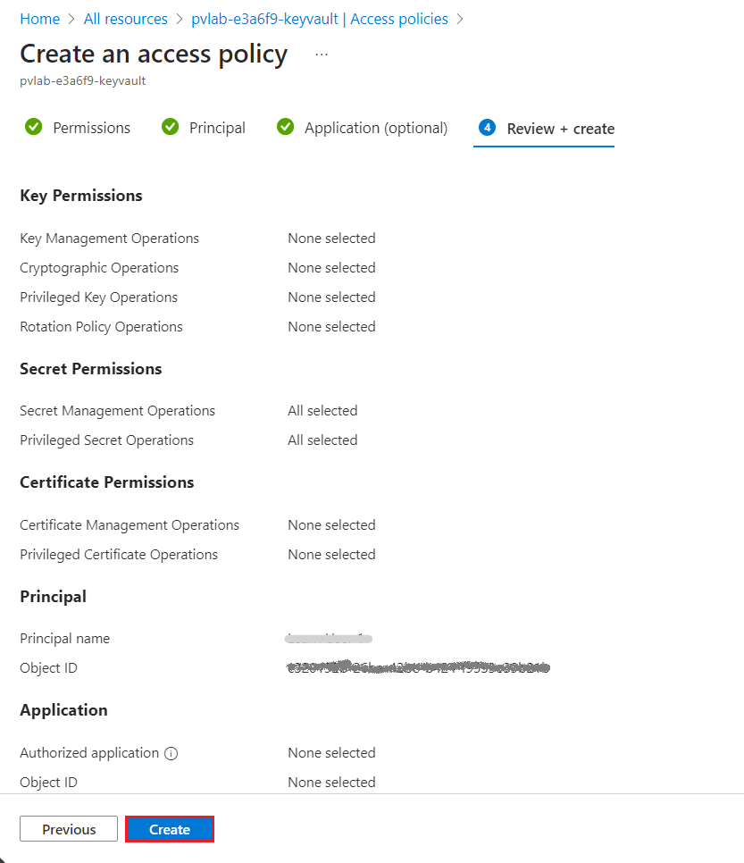
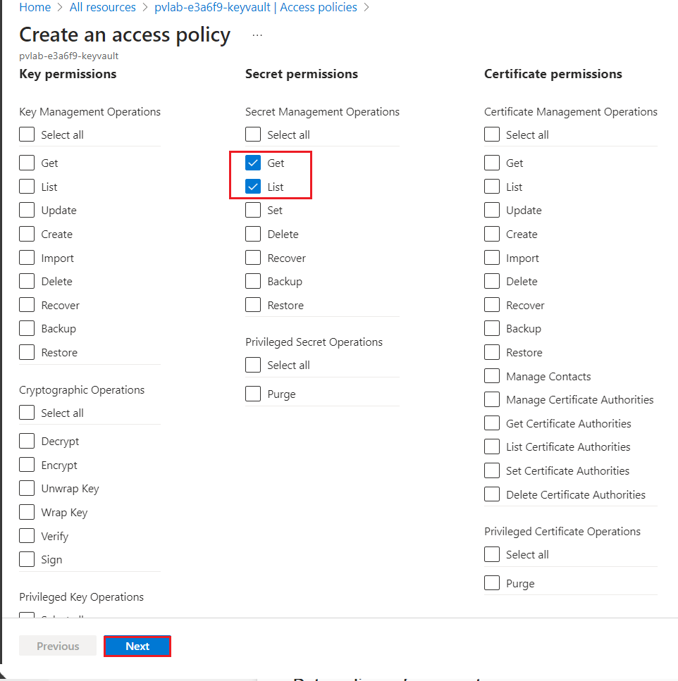
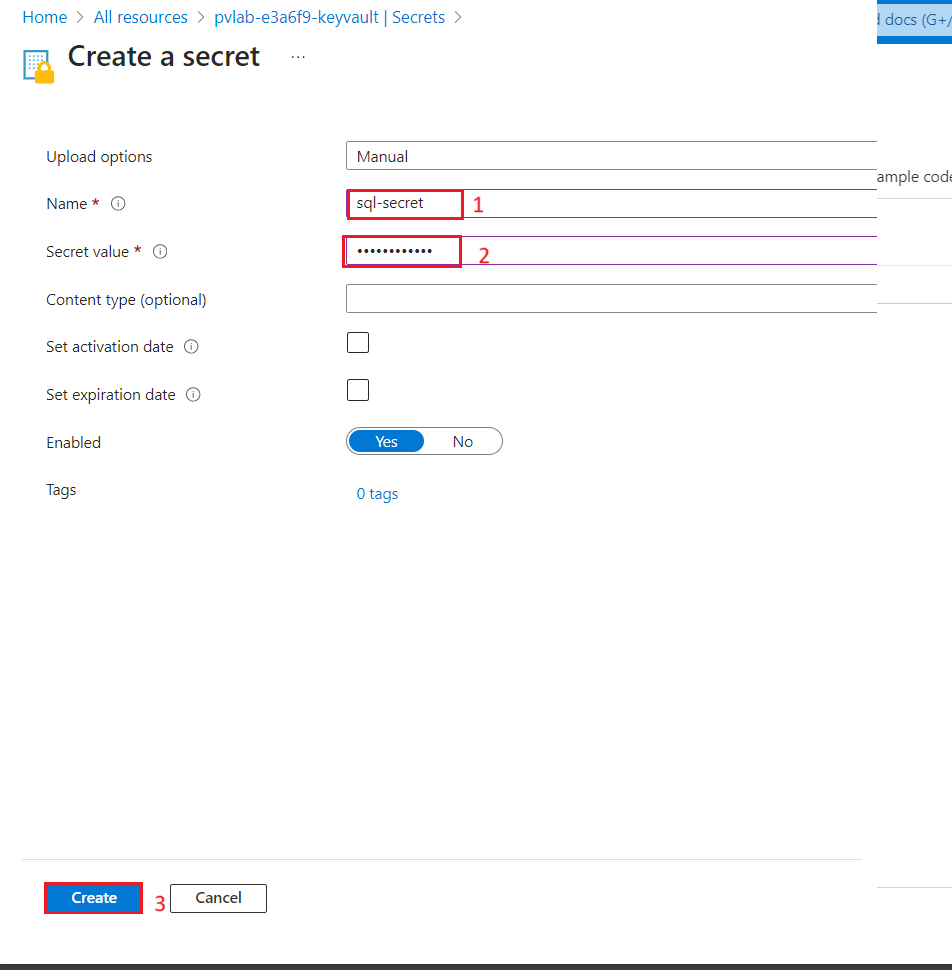
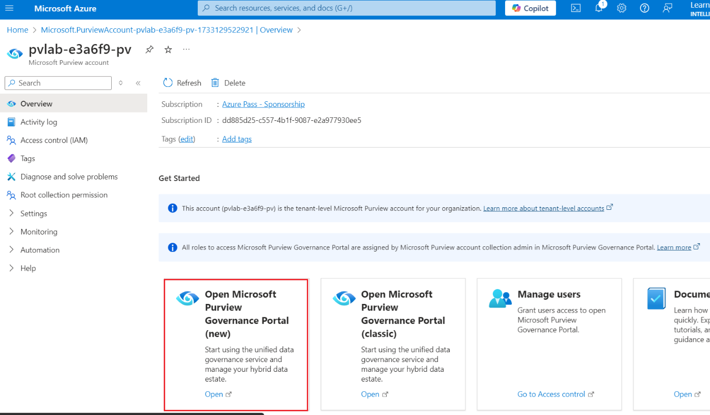

# Lab 2 - Registering & Scanning (ADLS Gen2 and Azure SQL DB)

**Introduction**

To populate Microsoft Purview with assets for data discovery and
understanding, you must register sources that exist across our data
estate so that we can leverage the out of the box scanning capabilities.
Scanning enables Microsoft Purview to extract technical metadata such as
the fully qualified name, schema, data types, and apply classifications
by parsing a sample of the underlying data.

In this lab, you'll walk through how to register and scan data sources.
You'll create a new collection for your first data source, upload data
and configure scanning. By the end of this module you'll have technical
metadata, such as schema information, stored in Purview. You can use
this to start linking to business terms, allowing your team members to
easier find data.

**Objectives**

- Create a collection.

- Register and scan an Azure Data Lake Storage Gen2 account using the
  Microsoft Purview managed identity.

## Exercise 1: Register & Scan ADLS Gen2 account

### Task 1: Grant the Microsoft Purview Managed Identity Access

In this module we will walk through how to grant the Microsoft Purview
system-assigned managed identity the necessary access to successfully
configure and run a scan.

1.  Navigate to the **Home** tab of Azure portal and select **All
    resources**.

     

2.  Select your **Azure Data Lake Storage Gen2 account**
    (e.g. pvlab{randomId}adls).

     )

3.  Select **Access Control (IAM)** from the left navigation menu.

4.  Click **+ Add** and then click **Add role assignment**.

     

5.  Filter the list of roles by searching for !!**Storage Blob Data Reader!!**, click the row to select the role, and then
    click **Next**.

      

6.  Under **Assign access to**, select **Managed identity**, click **+Select members**, select **Microsoft Purview account** from the **Managed Identity** drop-down menu, select the managed identity for your Microsoft Purview account (e.g. pvlab-{randomId}-pv),click **Select**. Finally, click **Review + assign**.

     
7.  Click **Review + assign** once more to perform the role assignment.

    

8.  Select **Review + assign** again.

     

9.  To confirm the role has been assigned, navigate to the **Role
    assignments**. You should be able to see that the Microsoft Purview
    managed identity has been granted the **Storage Blob Data
    Reader** role.

      

10. Select **Access Control (IAM)** from the left navigation menu.

11. Click **+ Add** and then click **Add role assignment**.

    

12. Filter the list of roles by searching for **Storage Account
    Contributor** , click the row to select the role, and then
    click **Next**.

    

13. Under **Assign access to**, click **+ Select members**,
    select **Microsoft Purview account** from for your Microsoft Purview
    account (e.g. pvlab-{randomId}-pv), click **Select**. Finally,
    click **Review + assign**.

      

14. Click **Review + assign** once more to perform the role assignment.

      

15. You will see a notification – added as Storage Account Contributor
    for pvlab-{randomID}-pv

     

### Task 2: Upload Data to Azure Data Lake Storage Gen2 Account

1.  In the Azure Data Lake in the Overview page. In the left-side
    navigation pane, navigate to **Data storage** section, then click on
    **Containers**. Click on **+Container**

      

2.  On the New container pane that appear on the right side, enter the
    container **Name** as **!!raw!!** and click on **Create** button.

      

3.  On **Azure storage | Containers** page, select **raw**
    container.

      

4.  On **raw** container page, click on **Upload** button.

      

5.  In the **Upload blob** pane, click on **Browse for file**, navigate
    to **C:\Labfiles** location and select **2020 folder**, then click
    on the **Open** button.

     

      

6.  In the **Upload blob** pane, drop down the Advanced, enter **2020**
    as **Upload to folder** and click on **Upload**

      

     

7.  On **raw** container page, click on **Upload** button.

     

8.  In the **Upload blob** pane, click on **Browse for file**, navigate
    to **C:\Labfiles** location and select **2021 folder**, then click
    on the **Open** button.

      

9.  In the **Upload blob** pane, drop down the Advanced, enter **2021**
    as **Upload to folder** and click on **Upload**

      

      

### Task 3: Create a Collection

1.  Navigate back to **Microsoft Purview resource group**
    **(purviewlab-rg)**.

      

2.  Open the **Microsoft Purview account** **(pvlab-RandomId-pv)**.

      

3.  Open the **Microsoft Purview Governance Portal**.

      

4.  Navigate to **Data Map** \> **Domains** and click **+ New
    collection**.

    
    
    

5.  Enter **!!Contoso!!** in the **Display name** field and
    click **Create**.

    

    

### Task 4: Register a Source (ADLS Gen2)

1.  On the **Microsoft Purview Portal**, navigate to **Data
    Map** \> **Data Sources**, and click on **Register**.

      

2.  Search for !!**Data Lake!!**, select **Azure Data Lake Storage
    Gen2**, and click **Continue**.

     

3.  Select the **Azure subscription**, **Storage account
    name**, **Collection**, and click **Register**.

      
      

### Task 5: Scan a Source with the Microsoft Purview Managed Identity

1.  On the **Microsoft Purview Portal**, navigate to **Data
    Map** \> **Data Sources**, and within the **Azure Data Lake Storage
    Gen2** tile, click the **New Scan** button.

      

2.  Click **Test connection** to ensure the Microsoft Purview managed
    identity has the appropriate level of access to read the Azure Data
    Lake Storage Gen2 account. If successful, click **Continue**.

      

3.  Expand the hierarchy to see which assets will be within the scans
    scope, and click **Continue**.

      

4.  Select the system default scan rule set and click **Continue**.

      

5.  Select **Once** and click **Continue**.

      

6.  Click **Save and Run**.

     

7.  To monitor the progress of the scan run, click **View Details**.

      

8.  Click **Refresh** to periodically update the status of the scan.
    Note: It will take approximately 5 to 10 minutes to complete.

      
   
     

### Task 6: View Assets

1.  On the **Microsoft Purview Governance Portal**, navigate
    to **Unified Catalog** , expand  **Discovery** and select **Data
    assets**, type the asterisk character (**\***) into the search bar,
    and hit **Enter**.

      

2.  You should be able to see a list of assets within the search
    results, which is a result of the scan.

     

## Exercise 2: Register & Scan Azure SQL DB account

To populate Microsoft Purview with assets for data discovery and
understanding, we must register sources that exist across our data
estate so that we can leverage the out of the box scanning capabilities.
Scanning enables Microsoft Purview to extract technical metadata such as
the fully qualified name, schema, data types, and apply classifications
by parsing a sample of the underlying data.

In this exercise, you'll walk through how to register and scan data
sources. You'll create a new collection for your first data source,
upload data and configure scanning. By the end of this exercise you'll
have technical metadata, such as schema information, stored in Purview.
You can use this to start linking to business terms, allowing your team
members to find data more easily.

### Task 1: Key Vault Access Policy \#1 (Grant Yourself Access)

1.  Navigate to the **Home** tab of Azure portal and select **All
    resources**.

      

2.  Select your **Azure Key Vault** resource (Eg. Pvlab
    {RandomId}-keyvault).

     

3.  In the **Key vault** home page, select **Access policies** and
    click **+ Create**.

      

4.  Under **Secret permissions**, click **Select all**. Then,
    click **Next**.

     

5.  Search for your **account name**, select your account name from the
    search results, then click **Next**.

      

6.  Skip the **Application (optional)** page by clicking **Next** again.

      

7.  Review your selections then click **Create**.

      

      
### Task 2: Key Vault Access Policy \#2 (Grant Microsoft Purview Access)

In this next step, we are creating a second access policy which will
provide Microsoft Purview the necessary access to retrieve secrets from
the Key Vault.

1.  In the **Key vault** home page, select **Access policies** and
    click **+ Create**.

      

2.  Under **Secret permissions**, select **Get** and **List**. Then,
    click **Next**.

      

3.  Search for the name of your **Microsoft Purview account**
    (e.g. pvlab-{randomID}-pv), select the item, then click **Next**

      

4.  Skip the **Application (optional)** page by clicking **Next** again.

      

5.  Review your selections then click **Create**.

     

      

### Task 3: Generate a Secret

In order to securely store our Azure SQL Database password, we need to
generate a secret.

1.  Navigate to **Secrets** and click **Generate/Import**.

      

2.  **Copy** and **paste** the values below into the matching fields and
    then click **Create**.

    **Name - !!sql-secret!!**
   
    **Value - !!sqlPassword!!!**
 
    

    

### Task 4: Add Credentials to Microsoft Purview

To make the secret accessible to Microsoft Purview, we must first
establish a connection to Azure Key Vault.

1.  Navigate back to the **Home** tab of Azure portal and select **All
    resources**.

      

2.  Open the **Microsoft Purview account** **(pvlab-RandomId-pv)**.

      

3.  Open the **Microsoft Purview Governance Portal**.

      

4.  Navigate to **Data Map**, dropdown the **Source management** and
    click on **Credentials.**
    

5.  In the Credentials pane, click **Manage Key Vault connections**.

     

6.  In the **Manage Key Vault connections** tab, Click **New**.

     

7.  **Copy** and **paste** the value below to set the name of your **Key
    Vault connection**, and then use the drop-down menu items to select
    the appropriate **domain**, **Subscription** and **Key Vault name**,
    then click **Create**.

      **Name – !!KeyVault01!!**

      

8.  Since we have already granted the Microsoft Purview managed identity
    access to our Azure Key Vault, click **Confirm**.

     

9.  In the **Manage Key Vault connections** tab, click **Close**.

      

10. Under **Credentials** click +**New**.

     

11. Using the drop-down menu items, set the **Authentication
    method** to SQL authentication and the **Key Vault connection** to
    KeyVault01. Once the drop-down menu items are
    set, **Copy** and **paste** the values below into the matching
    fields, and then click **Create**.

      - **Name - !!credential-SQL!!**
      
      - **User name - !!sqladmin!!**
      
      - **Secret name - !!sql-secret!!**

     
 
      

### Task 5: Register a Source (Azure SQL DB)

1.  On the **Microsoft Purview Portal**, navigate to **Data
    map** \> **Data Sources**, and click **Register**.

     

2.  Search for !!SQL Database!!, select **Azure SQL Database**, and
    click **Continue**.

      

3.  Select the **Azure subscription**, **Server name
    (pvlab-RandomId-sqlsvr)**, and **Collection
    (pvlab-RandomId-pv\>Contoso)**. Click **Register**.

      

### Task 6: Scan a Source with Azure Key Vault Credentials

1.  On the **Microsoft Purview Governance Portal**, navigate to **Data
    map** \> **Sources**, and within the Azure SQL Database tile, click
    the **New Scan** button.

      

2.  Select your **Database** (e.g. pvlab-{randomID}-sqldb), set
    the **Credential** to **credential-SQL**, turn **Lineage
    extraction** to **Off**, and click **Test connection**. Once the
    connection test is successful, click **Continue**.

   **Note**:If the "Test connection" appears to be hanging, click Cancel and re-try.
       
       

3.  Click **Continue**.

     

4.  Click **Continue**.

     

5.  Set the trigger to **Once**, click **Continue**.

     

6.  Click **Save and Run**.

      

7.  To monitor the progress of the scan, click **View Details**.

      

8.  Click **Refresh** to periodically update the status of the scan.

     **Note**:It will take approximately 5 to 10 minutes to complete.
 
      
    
    

### Task 7: View Assets

1.  On the **Microsoft Purview Governance Portal**, navigate
    to **Unified Catalog** , expand  **Discovery** and select **Data
    assets**, type the asterisk character (**\***) into the search bar,
    and hit **Enter**.

     

     

2.  You should be able to see a list of assets within the search
    results, which is a result of the scan.

     
>
> **Summary**
>
> This lab provided an overview of how to create a collection, register
> a source, and trigger a scan.
