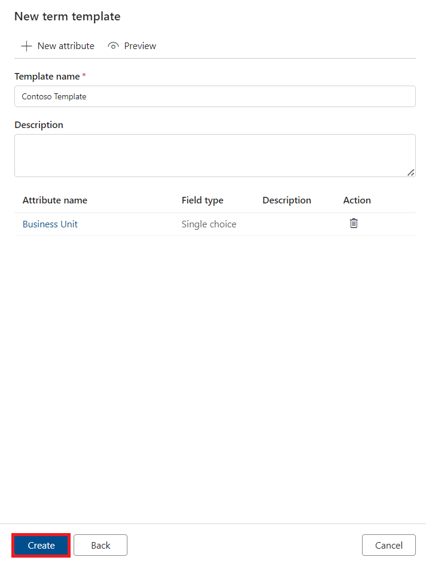

# Lab 04 – Glossary

**Introduction**

A Glossary, sometimes called Data Glossary or Business Glossary, is a
list of business terms with their definitions. A Glossary is an
important tool for maintaining and organizing information about your
data. It is used for capturing domain knowledge of information that is
commonly used, communicated, and shared in organizations as they are
conducting business.

There aren’t any rules for the size and representation of glossaries.
They can stay abstract or high-level, but also are allowed to be
detailed, describing carefully attributes, dependencies, relationships
and definitions. A glossary isn't limited to only a single database, in
fact it can cover many applications or multiple databases. Multiple
applications can work together to accomplish a specific business need.
This means that the relation between a glossary and data attributes is a
one-to-many relationship. The glossary can also include and capture more
concepts than the concepts representing the application or database
itself. It can include concepts, which are used to make the context
clearer, but don’t play a direct role (yet) in the application or
database design. It can also include concepts, that represents future
requirements, but didn’t find their way yet into the actual design of
the application or database yet.

When implementing your Glossary it is important to think about how you
will structure your business terms and definitions. For example, you
could use hierarchies and align these with business domains such as:
Finance, Marketing, Sales, HR, etc. You could think of naming standards
or introduce term templates for capturing additional information about
your business metadata. You could also use relationships for linking
business terms, such as Acronyms, Related terms and Synonyms. These
relationships could help to avoid creating terms with duplicated names
and lower the overhead of management.

In this lab you learn how to create terms using a system and custom term
template. You'll also learn how to import and export terms. Lastly, you
learn about linking terms to data assets, which helps to relate
technical metadata to business metadata.

**Objectives**

- Create a Term in the Glossary using the System Default Term Template.

- Create a Term in the Glossary using a Custom Term Template.

- Bulk Import Terms into the Glossary via a CSV file.

- Bulk Export Terms from the Glossary into a CSV file.

- Assign a Term to an Asset in the Data Catalog.

- Update an existing Term with Related Terms and Contacts.

## Task 1: Create a Term in the Glossary using the System Default Term Template

1.  Open the **Microsoft Purview Governance Portal**.

     

2.   From the **Unified data catalog**, dropdown the **Catalog
    management** and select the **Classic types.**

     

3.  In the **Classic types** tab , click on the **Create a new
    glossary**

     

4.  In New glossary tan enter

     

     

5.  **Copy** and **paste** the values below into the appropriate fields,
    select your **Domain** and set your **Tenant** as
    the **Steward** and **Expert**, and click **Create**.

      **Name - Glossary**
     
      **Description -** A glossary is a vocabulary of business terms that
      can be mapped to assets like a database, tables, columns etc. Glossary
      terms can help establish a common language across the business,
      abstracting the technical jargon typically associated with data
      repositories.
 
  

## Task 2. Create a Term (System Default Term Template)

1.  On the **Microsoft Purview Governance Portal** and from
    the **Unified data catalog**, drop down the **Catalog management**
    and select **Classic types**. Now click **+ New term**

      

2.  In the New term tab, select the **System default** term template and
    click **Continue**.

     

3.  Change the **Status** of the term to **Approved** and
    then **copy** and **paste** the values below into the appropriate
    field, then click **Create**.

      **Name - !!Contoso Parent!!**
     
      **Definition - !!This will be the parent term.!!**
     
     **Acronym - !!CP!!**
     
      **Resource Name - !!Microsoft Purview!!**
     
      **Resource Link - !!https://aka.ms/MicrosoftPurview!!**
     
      
    
      

## Task 3. Create a Term (Custom Term Template)

1.  On the **Microsoft Purview Governance Portal** and from
    the **Unified data catalog**, drop down the **Catalog management**
    and select **Classic types**

     

2.  On the **Glossary** pane, Click **+ New term**.

     

3.  On the New term tab, Click **+ New term template**.

      

4.  On the New term template tab, enter !!**Contoso Template!!** in the
    **Template name** field and click + **New attribute**.

      

5.  On the New attribute tab, populate the attribute fields as per the
    examples below and click **Apply**.

    |Field	|Example Value|
    |---|---|
    |Attribute name|	!!Business Unit!!|
    |Field type|	Single choice|
    |Choices|	!!Sales!!                                                                                                    !!Marketing!!                                                                                                            !!Finance!!                                                                                                              !!Human Resources!!                                                                                                  !!IT!!   |

     

6.  On the New term template tab, Click **Create**.

      

      

7.  Now on the New term tab, select **Contoso Template** and
    click **Continue**.

      

8.  Change the **Status** of the term to Approved and
    then **copy** and **paste** the values below into the appropriate
    field, then click **Create**.

      **Name - !!Contoso Child!!**
     
     **Definition - !!This will be the long description for the child
      glossary term.!!**
     
      **Parent -** Contoso Parent
     
      **Business Unit –** Marketing
     
      
    
       

      

9.  From the **Unified Catalog** screen, select **Terms**, then toggle
    the view to **Hierarchical view** to see the hierarchical glossary.

      
     
      

## Task 4. Bulk Import Terms

1.  From the **Glossary** screen, click **Import terms**.

      

2.  Select the **System default** term template and click **Continue**.

      

3.  Click **Browse** and open the file **import-terms-sample.csv** from
    **C:\LabFiles** on your Lab VM.

      
     
      

4.  In Import terms tab, click **OK**.

      
     
      

5.  Once complete, you should see 50 additional terms beneath the parent
    (Workplace Analytics). 

   **Tip** :You can quickly find specific types of terms using the filters at the top (e.g. Status = Approved).
 
  

## Task 5. Bulk Export Terms

1.  From the **Glossary** screen, we want to select ALL terms (top check
    box) and then de-select terms that do not belong to Workplace
    Analytics (i.e. Contoso Parent, Contoso Child). **All Workplace
    Analytics terms** should be selected. Click **Export terms**.

    

2.  If the export was successful, you should find a **CSV** file has
    been copied to your local machine (e.g. Downloads).

    

## Task 6. Assign a Term to an Asset

1.  On the **Microsoft Purview Governance Portal**, navigate
    to **Unified Catalog** , expand  **Discovery** and select **Data
    assets**, type the asterisk character (**\***) into the search bar,
    and hit **Enter**.

      

2.  On **QueriesByState** pane, Click **Edit**.

      

3.  Open the **Glossary terms** drop-down menu and select a glossary
    term (e.g. Contoso Child). Click **Save**.

      
 
     

4.  Click on the hyperlinked term name to view the glossary term
    details.

      

5.  Click **Refresh** to view the **Catalog assets** the term is
    assigned to.

      

## Task 7. Update an Existing Term

1.  On the **Microsoft Purview Governance Portal** and from
    the **Unified catalog**, navigate to **Classic types**, and
    select **Glossary**.

      

2.  From the **Glossary** screen, select **View terms**.

     

3.  On the Glossary pane, select an existing term called
    **Aggregation**.

      

4.  On Aggregation pane ,navigate to the **Related** tab and
    click **Edit**.

     

5.  Use the drop-down menu to assign two glossary terms as **Synonyms**
    (e.g. **Workspace Analytics \> Attended** and **Workspace Analytics
    \> Attendee**).

     

6.  Use the drop-down menu to assign two glossary terms as **Related
    terms** (e.g. **Workspace Analytics \> Collaborator group** and
    **Workspace Analytics \> Collaborators**).

     

7.  Navigate to the **Contacts** tab and assign your **Tenant** as
    an **Expert** and a **Steward**. Click **Save**.

       

       
      
**Summary**

This lab provided an overview of how to create, export, and import terms
into the Microsoft Purview glossary.
