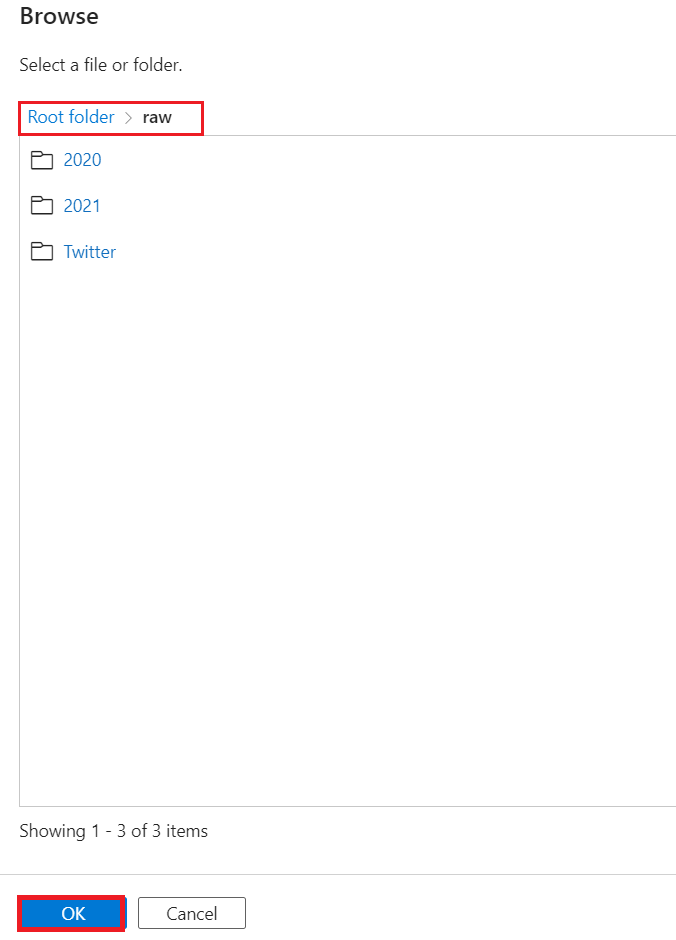

# Lab 06 – Lineage between datasets created by data processes

**Introduction**

One of the features of Microsoft Purview is the ability to show the
lineage between datasets created by data processes. Data lineage shows
how data moves over time and enables you to see how data is used and
what changes to data have been made. This visibility helps you to
understand, trace back and correct data at the source of origin.
Lineage, thus also results into better data quality.

Lineage is typically captured from tools that extract, transform and
load data. These ETL tools are, for example, Data Factory, Data Share,
and Power BI. They capture the lineage of data as it moves. By scanning
these ETL tools you can capture and visualize the lineage in Microsoft
Purview.

Microsoft Purview also supports the ability to document custom lineage.
Custom lineage is lineage that you created yourself, for example by
uploading metadata using the Microsoft Purview's Atlas REST APIs, or by
adding manual lineage via the Microsoft Purview governance portal.
Lineage in Purview includes relationships between datasets and
processes**.**

**Objectives**

- Connect an Azure Data Factory account with a Microsoft Purview
  account.

- Trigger a Data Factory pipeline to run so that the lineage metadata
  can be pushed into Purview.

## Task 1 :Create an Azure Data Factory Connection in Microsoft Purview

1.  Open the **Microsoft Purview Governance Portal**.

    

2.  Navigate to **Data Map,** dropdown the **Source management** and
    select **Lineage connection**.

      

3.  In **Lineage connections** pane, select **Data Factory** and select
    **+New**

  
 
    ⚠️ To view/add/remove Data Factory connections, you need to be
    assigned the **Collection admin** role on the root collection.

4.  Select your **Azure Subscription**. Select your **Azure Data
    Factory** account instance from the drop-down menu
    (e.g. pvlab-{randomId}-adf) and click **OK**.

      

5.  Once finished, you should see the Data Factory in
    a **connected** state.

      

6.  To confirm that Azure Data Factory has been provided the necessary
    access, navigate to **Data
    map** \> **Domains** \>** pvlab-RandomId-pv \> Contoso** \> **Role
    assignments**, within **Data curators** you should be able to see
    the Azure Data Factory managed identity.

    

    

## Task 2: Copy Data using Azure Data Factory Studio.

1.  Navigate to the **Home** tab of Azure portal and select **All
    resources**.

     

2.  Switch to the **Azure Portal** tab and navigate to your **Azure Data
    Factory** resource (pvlab-{randomId}-adf).

     

3.  Click **Launch Studio** on the **Azure Data Factory Overview** page.

     

4.  Click **Ingest**.

     

5.  Select **Built-in copy task** and then click **Next**.

      

6.  Change the **Source type** to **Azure Data Lake Storage Gen2** and
    then click **+ New connection**.

      

7.  Select your **Azure subscription** and **Storage
    account** (e.g. pvlab{randomId}adls), click **Test connection** and
    then click **Create**.

    
  
    

8.  In the Source data store pane, click **Browse**.

      

9.  Navigate to **raw \> 2020** and click **OK**.

    

10. Confirm your folder path selection and click **Next**.

    

11. Preview the sample data by clicking **Preview data**, and then
    click **Next**.

    

12. Change the **Destination type** to **Azure Data Lake Storage Gen2**,
    set the **Connection** to the existing connection
    (e.g. AzureDataLakeStorage1), and then click **Browse**.

    

13. Navigate to raw/ and click **OK**.

    

14. Confirm your folder path selection, set the **file
    name** to **2020_merged.parquet**, set the **copy
    behavior** to **Merge files**, and click **Next**.

    

15. Set the **file format** to **Parquet format** and click **Next**.

    

16. Leave the default settings and click **Next**.

    

17. Review the summary and proceed by clicking **Next**.

     

18. Once the deployment is complete, click **Finish**.

      

19. Navigate to the **Monitoring** screen to confirm the **pipeline**
    has run **successfully**.

     

## Task 3: View Lineage in Microsoft Purview

1.  Navigate to the **Microsoft Purview Governance Portal**, from the
    **Unified catalog** screen select Data assets and click **Explore by
    source type**.

      

2.  Switch to the **By source type** tab and then select **Azure Data
    Factory**.

      

3.  Select the **Azure Data Factory account
    instance** (e.g. pvlab-{randomId}-adf).

      

4.  Select the **Copy Pipeline** and click to open the **Copy
    Activity**.

    
   
    

5.  Navigate to the **Lineage** tab.

    

6.  You can see the lineage information has been automatically pushed
    from Azure Data Factory to Purview. On the left are the two sets of
    files that share a common schema in the source folder, the copy
    activity sits in the center, and the output file sits on the right.

    

**Summary**

This module provided an overview of how to integrate Microsoft Purview
with Azure Data Factory and how relationships between assets and ETL
activities can be automatically created at run time, allowing us to
visually represent data lineage and trace upstream and downstream
dependencies.
