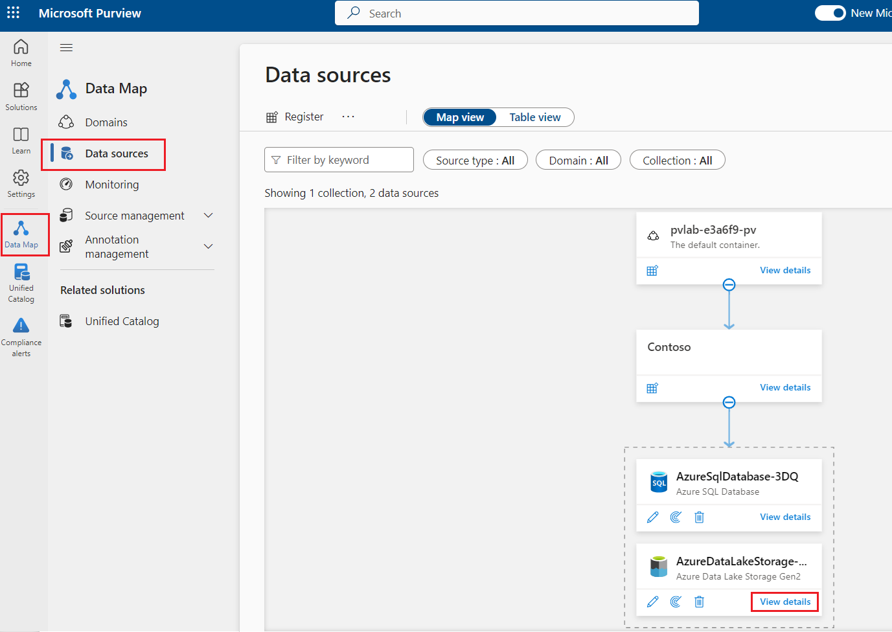
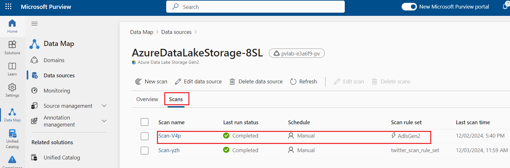
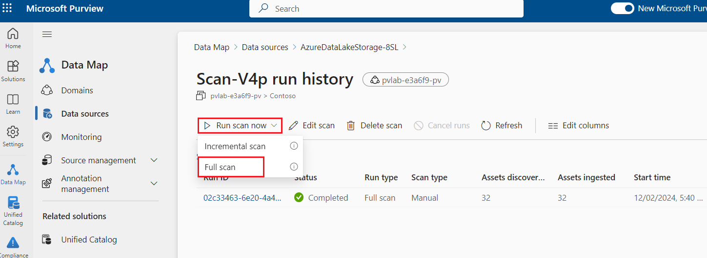
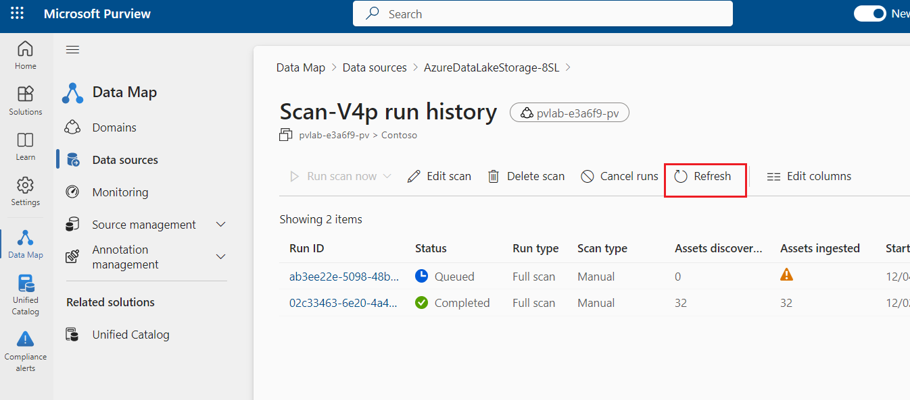
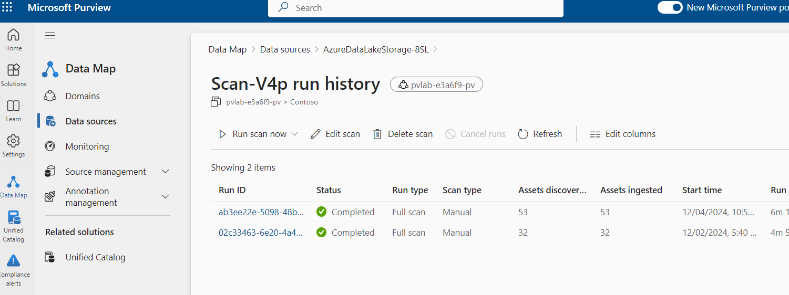
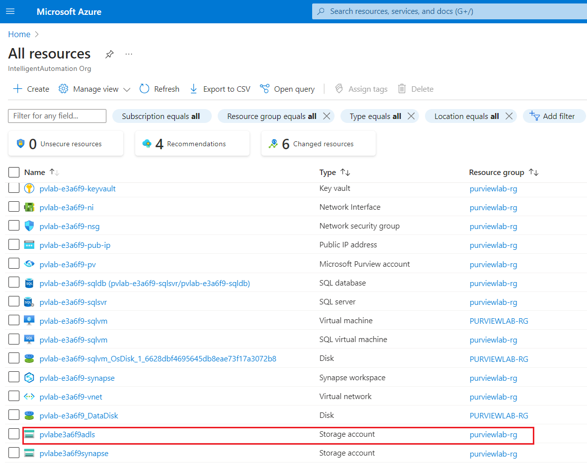
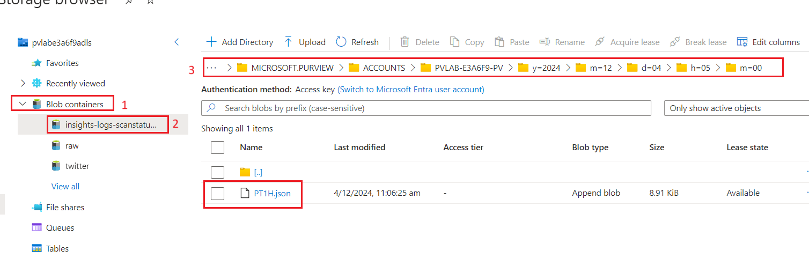
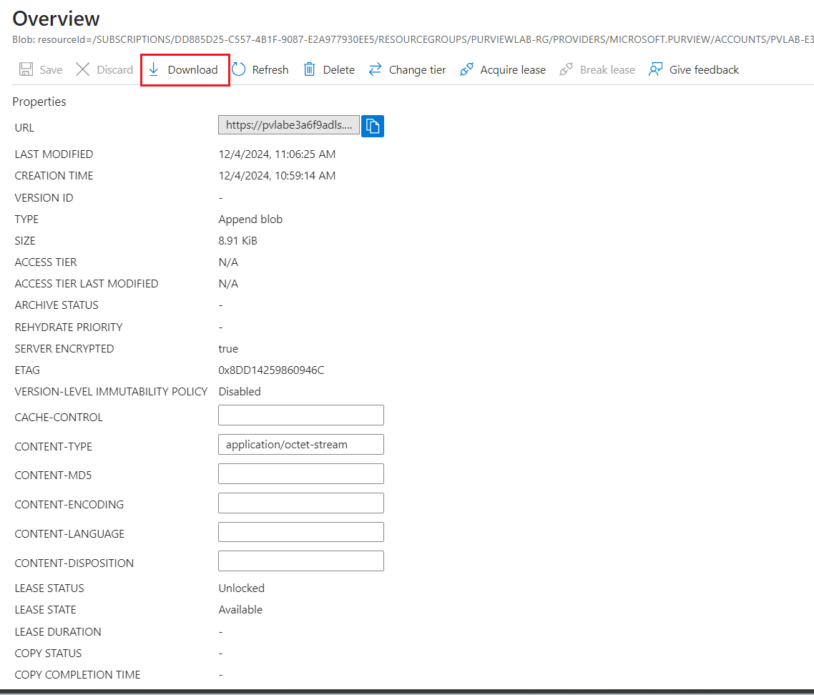

# Lab 7 - Visualizing Microsoft Purview Metrics

## Task 1: Add a user to the Monitoring Reader role

Metrics can be accessed from the Azure Portal for a Microsoft Purview
account instance. Access to the metrics can be granted via a role
assignment.

- The person who created the Microsoft Purview account automatically
  gets permissions to view metrics.

- Other individuals can be provided access by adding them to
  the **Monitoring Reader** role.

1.  Navigate to the **Home** tab of Azure portal and select **All
    resources**.

> 

2.  Open the **Microsoft Purview account** **(pvlab-RandomId-pv)**.

3.  Select **Access Control** and click **+ Add** and then **Add role
    assignment**.

4.  Filter the list of roles by searching for **Monitoring Reader**,
    select the **Monitoring Reader** role and then click **Next**.

5.  Click **+ Select members**, search for a user within your **Azure
    Active Directory**, select that user from the list, and then
    click **Select**.

6.  Click **Review + assign** to progress to the final screen, then
    click **Review + assign** once more to add the role assignment.

## Task 2: Visualize Microsoft Purview Metrics

1.  From the left navigation pane of your **Microsoft Purview** account,
    click **Metrics**.

2.  Click to open the **Metric** drop-down menu and select one of the
    metrics (e.g. Scan time taken).

> **Available Metrics**

[TABLE]

3.  Click on the chart type to change the graph to a **Bar chart**.

4.  Click on the **time range** to change the duration to **Last 30
    Days** and click **Apply**.

5.  Below is an example.

> ***Note***
>
> *The account instance would need some historical scan activity in
> order to visualize the metric.*

## Task 3: Send Diagnostic Logs to Azure Storage

1.  From the left navigation pane of your **Microsoft Purview** account,
    click **Diagnostic settings** and select **+ Add diagnostic
    setting**.

2.  Enter **Audit** in the **Diagnostic setting name** field,
    select **ScanStatus**, select **Archive to a storage account**,
    select an existing storage account (e.g. pvlab{randomId}adls) and
    click **Save**.

> 

3.  To test the capture of raw events, trigger a full scan by navigating
    to the **Microsoft Purview Governance Portal** \> **Data
    map** \> **Data** **Sources** and click **View details** on the
    **Azure Data Lake Storage Gen2** source.

4.  Navigate to the **Scans** tab and click the name of a previously run
    scan for Azure Data Lake Storage.

5.  Open the **Run scan now** drop-down menu and select **Full Scan**.

6.  Monitor the scan status by periodically clicking
    the **Refresh** button.

7.  Once the scan is complete, navigate to the **Azure portal** and
    select the **Home** tab. Select **All resources**.

7.  Select your **Azure Data Lake Storage** account
    ***pvlab{RandomId}adls**.*

8.  Select **Storage browser**, expand **Blob containers** and
    select **insights-logs-scanstatuslogevent**, navigate down the
    folder hierarchy until you reach a JSON document (e.g. PT1H.json).

> 

9.  Download and open a local copy of the JSON document with your choice
    of text editor (e.g. Notepad++, VSCode, etc) to see details such as
    dataSourceName, dataSourceType, assetsDiscovered,
    scanTotalRunTimeInSeconds, and more.

