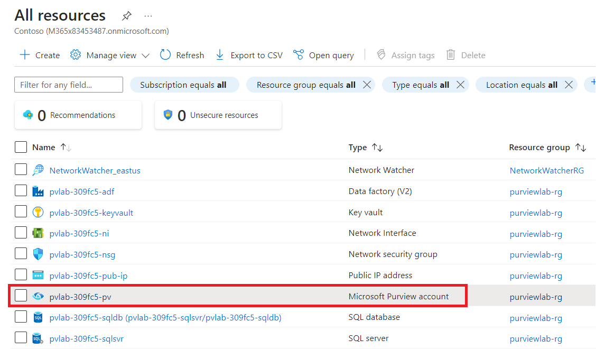

# Lab 7 - Visualizing Microsoft Purview Metrics

## Task 1: Add a user to the Monitoring Reader role

Metrics can be accessed from the Azure Portal for a Microsoft Purview
account instance. Access to the metrics can be granted via a role
assignment.

- The person who created the Microsoft Purview account automatically
  gets permissions to view metrics.

- Other individuals can be provided access by adding them to
  the **Monitoring Reader** role.

1.  Navigate to the **Home** tab of Azure portal and select **All
    resources**.

     

2.  Open the **Microsoft Purview account** **(pvlab-RandomId-pv)**.

     

3.  Select **Access Control** and click **+ Add** and then **Add role
    assignment**.

       

4.  Filter the list of roles by searching for **Monitoring Reader**,
    select the **Monitoring Reader** role and then click **Next**.

      

5.  Click **+ Select members**, search for a user within your **Azure
    Active Directory**, select that user from the list, and then
    click **Select**.

      

6.  Click **Review + assign** to progress to the final screen, then
    click **Review + assign** once more to add the role assignment.

      

## Task 2: Visualize Microsoft Purview Metrics

1.  From the left navigation pane of your **Microsoft Purview** account,
    click **Metrics**.

      

2.  Click to open the **Metric** drop-down menu and select one of the
    metrics (e.g. Scan time taken).

    **Available Metrics**

      |Metric ID|	Metric Name|	Metric Description|
      |----|----|
      |DataMapCapacityUnits|	Data Map Capacity Units	|Indicates the number of capacity units consumed.|
      |DataMapStorageSize|	Data Map Storage Size|	Indicates the data map storage size.|
      |ScanCancelled|	Scan Cancelled	|Indicates the number of scans cancelled.|
      |ScanCompleted|	Scan Completed|	Indicates the number of scans completed successfully.|
      |ScanFailed	|Scan Failed	|Indicates the number of scans failed.|
      |ScanTimeTaken|	Scan Time Taken	|Indicates the total scan time in seconds.|

      

3.  Click on the chart type to change the graph to a **Bar chart**.

    

4.  Click on the **time range** to change the duration to **Last 30
    Days** and click **Apply**.

    

5.  Below is an example.

  **Note**:The account instance would need some historical scan activity in order to visualize the metric.
    

