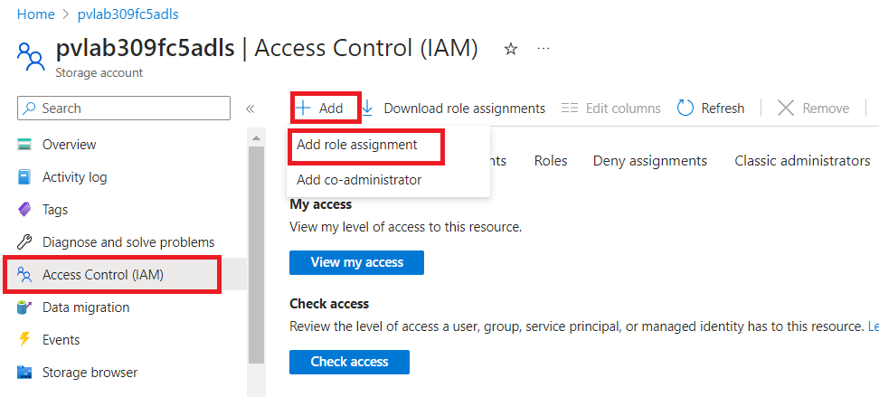
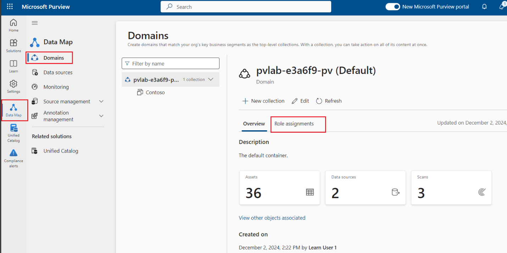

# Lab 8 - Integrating with Azure Synapse Analytics

## Task 1. Azure Data Lake Storage Gen2 Account Access

**Note**:Before we can demonstrate the ability to query external data sources
from Azure Synapse Analytics, we need to ensure our account has the
appropriate level of access (i.e. Storage Blob Data Reader).

1.  Navigate to the **Home** tab of Azure portal and select **All
    resources**.

     

2.  Navigate to the **Azure Data Lake Storage Gen2
    account** (e.g. pvlab{randomId}adls).

     

3.  Select **Access Control (IAM)**, and then click **+ Add** and then
    **Add role assignment**.

      

4.  Filter the list of roles available by searching for **Storage Blob
    Data Reader**, select the **Storage Blob Data Reader** role from the
    list, and click **Next**.

      

5.  To add your account, click **+ Select members**, search for your
    **Tenant** account by typing your username into the text box, select
    your account from the list, and click **Select**.

    
    

6.  Click **Review + assign** to progress to the final confirmation
    screen and then click **Review + assign** once more.

     

## Task 2:  Connect to a Microsoft Purview Account

1.  Navigate to the **Home** tab of Azure portal and select **All
    resources**.

    

2.  Open the **Synapse workspace** pvlab-{RandomId}-synapse.

    

3.  Click **Open Synapse Studio**.

     

4.  Navigate to **Manage** \> **Microsoft Purview** and click **Connect
    to a Purview account**.

     

5.  Select your **Purview account** from the drop-down menu and
    click **Apply**.

      

6.  Once the connection has been established, you will receive a
    notification that **Registration succeeded**.

     

7.  Switch to the **Purview account** tab to confirm that the Purview
    account is connected. On this page, you will also see a list of
    integration capabilities that are now available (e.g. Microsoft
    Purview search, Synapse Pipeline lineage, etc).

    
    
    

8.  To validate that Synapse was able to successfully add the Synapse
    managed identity to the **Data Curator** role, navigate to
    the **Microsoft Purview Governance Portal** \> **Data
    map** \> **Domains** \> **pvlab-RandomId-pv**, switch to the **Role
    assignments** tab and expand **Data curators**. You should be able
    to see the Synapse Service Principal listed as one of the Data
    curators. This will provide Synapse read/write access to the
    catalog.

     
    
     

## Task 3: Search a Microsoft Purview Account

1.  Within the Synapse workspace, navigate to the **Data** screen and
    perform a **keyword search** (e.g. parquet). Notice that the search
    bar now defaults to searching the entire Purview catalog as opposed
    to the Synapse workspace only.

      

2.  Click to open the **asset details** of one of the items
    (e.g. twitter_handles.parquet).

      

3.  Notice the special Synapse-specific menu items such
    as **Connect** and **Develop**. For supported file types such as
    parquet, you can quickly generate sample code to query the external
    source by navigating to **Develop** \> **New SQL
    script** \> **Select top 100**.

     

4.  To execute the query, click **Run**.

      ***Note***:The user executing the query must have the appropriate level of
     access (e.g. Storage Blob Data Reader), see step 1 for more details.

      
