# Lab 10 – Using Microsoft Purview REST APIs

### **Task 1: Download and Install Postman**

1.  Open a new tab and browse to the **Postman** 
    <https://www.postman.com/downloads/> downloads link on the Lab VM
    browser and click on **Windows 64-bit**.

> 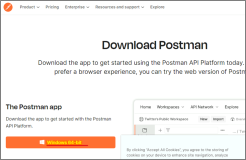

2.  Click on **Open file** to launch the installer.

> 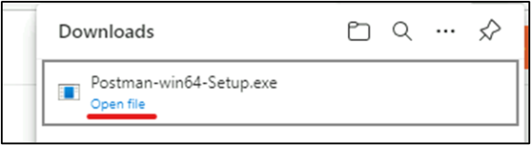
>
> 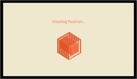

3.  Once the App is running, click on **Skip and go to the App**.

> 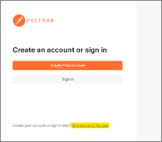

## Task 2: Register an Application

To invoke the REST API, we must first register an application (i.e.
service principal) that will act as the identity that the Microsoft
Purview platform reognizes and is configured to trust.

1.  Sign in to the **Azure portal**, select the left **Menu** button,
    navigate to **Microsoft Entra ID**

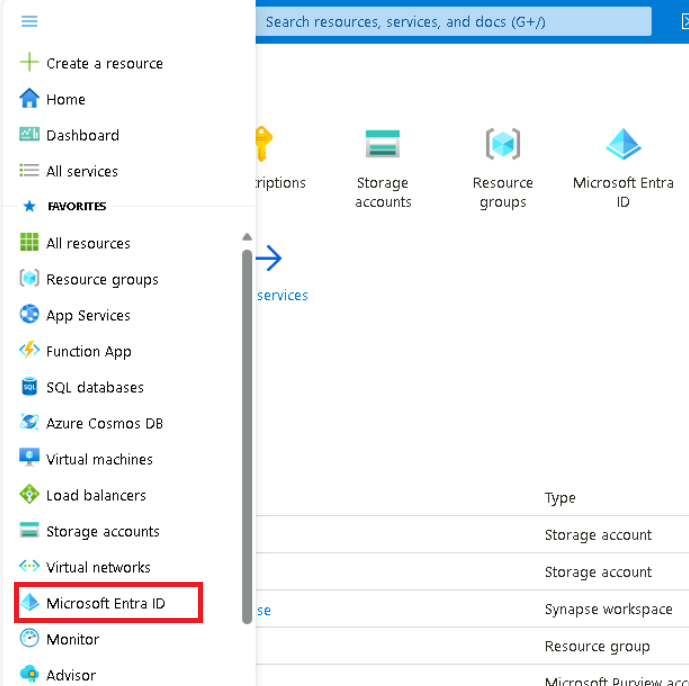

2.  On the **Microsoft Entra ID** select **App registrations** and
    click **+ New registration**.

3.  Provide the application a **name**, select an **account type**, and
    click **Register**.

[TABLE]

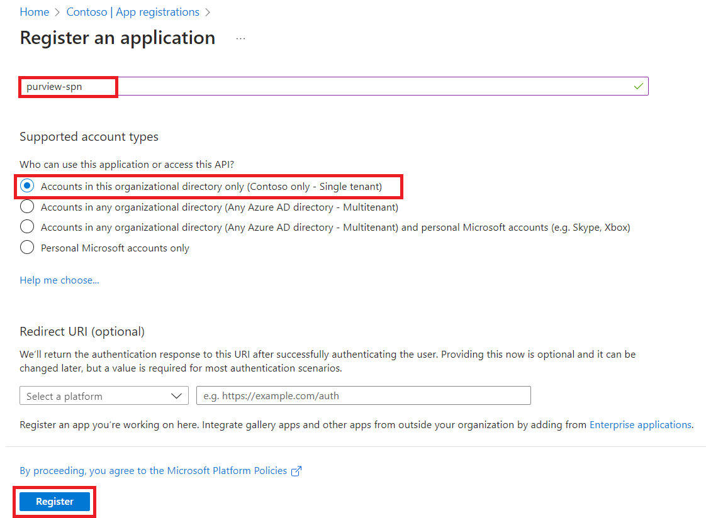

4.  **Copy** the following values for later use.

    - Application (client) ID

    - Directory (tenant) ID

## Task 3: Generate a Client Secret

1.  Navigate to **Certifications & secrets** and click **+ New client
    secret**.

2.  Provide the following values and click **Add**.

[TABLE]

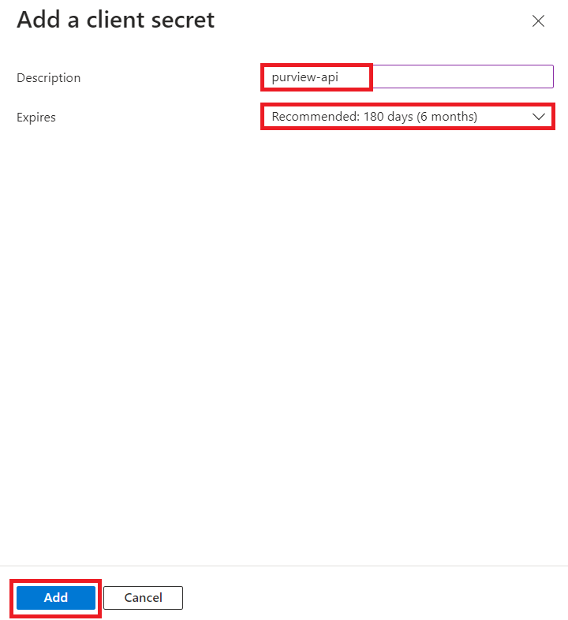

3.  **Copy** the client secret value for later use.

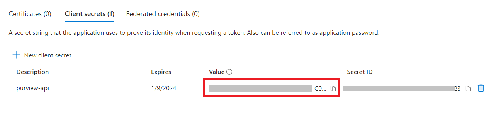

## Task 4: Provide Service Principal Access to Microsoft Purview

1.  Navigate to the **Home** tab of Azure portal and select **All
    resources**.

2.  Navigate to the **Microsoft Purview Account** *pvlab-{RandomId}-pv*.

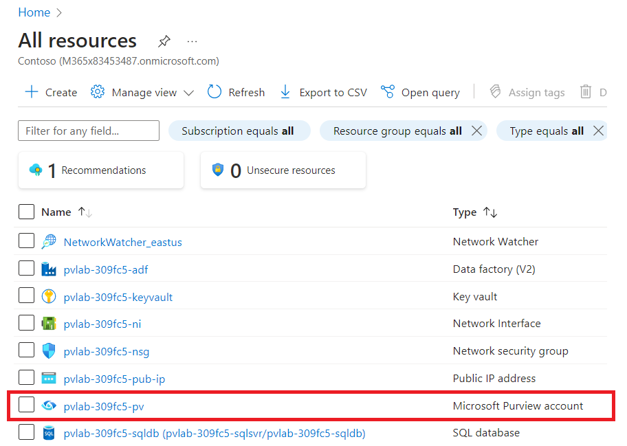

3.  Open the **Microsoft Purview Governance Portal**.

4.  Navigate to the **Data map** \> **Domains** \> **pvlab-{RandomId}-pv
    \> Role assignment**, and then click on the icon of **Add data
    curators**.

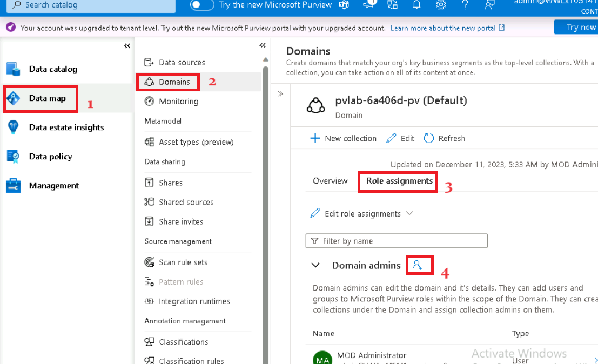

5.  Search for the name of the Service Principal **purview-spn**, select
    the Service Principal from the search results, and then
    click **OK**.

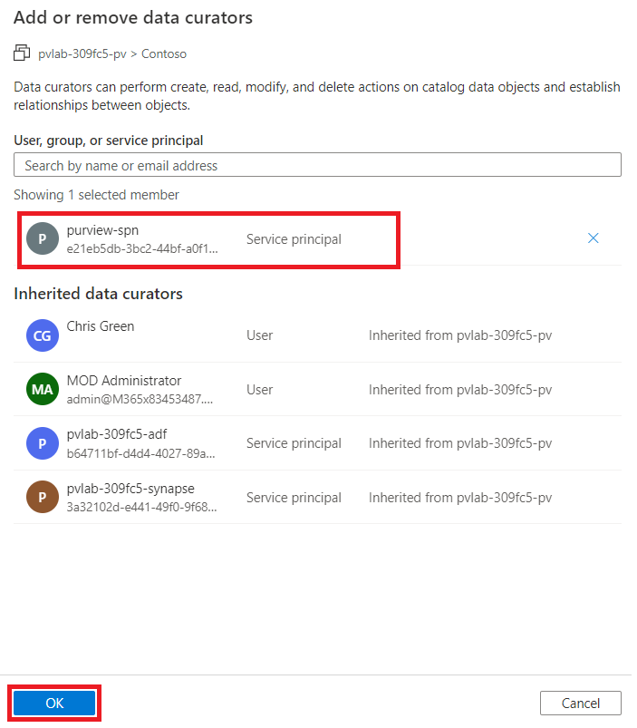

## Task 5: Get an Access Token

1.  Open a new tab on your browser and browse to the **Postman Web App**
    with the given link <https://identity.getpostman.com/login>.

2.  Select **Create account**.

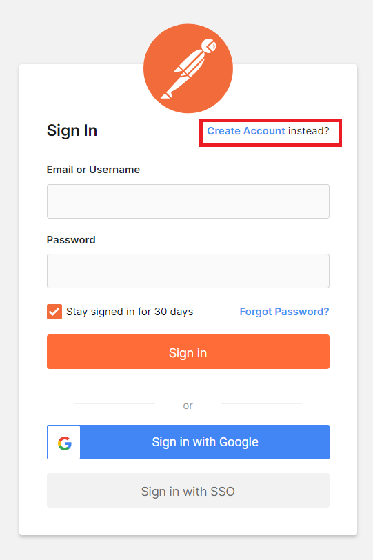

3.  Create a new account on **Postman Web App** with your **Office 365
    Admin Tenant** credentials.

4.  Save the **Username** and **Password** for future use.

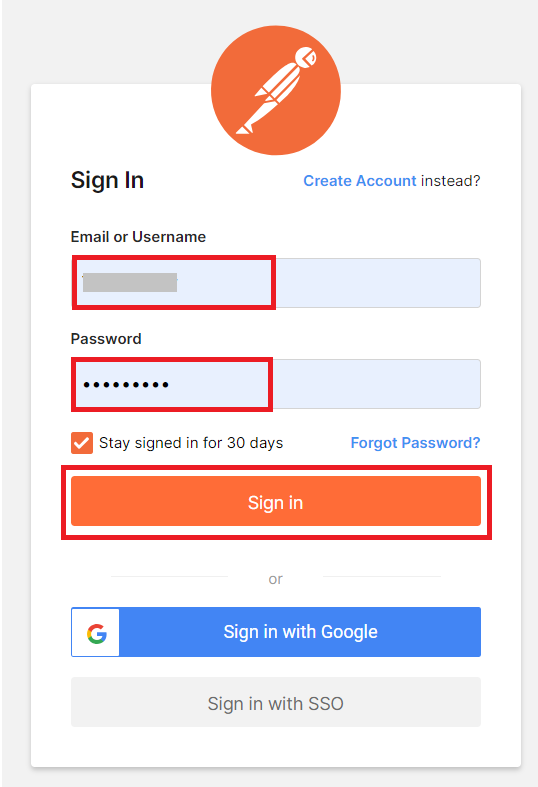

5.  witch back to the **Postman** app launched in Task 1,**Sign-In**
    with your **Username** and **Password**. Complete the
    **Authorization process**.

6.  Open **Postman Desktop App**, click on **Workspaces** and then
    select **My Workspace**.

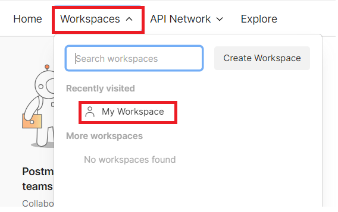

7.  On your workspace go to **Collections** and create a new **HTTP
    request**.

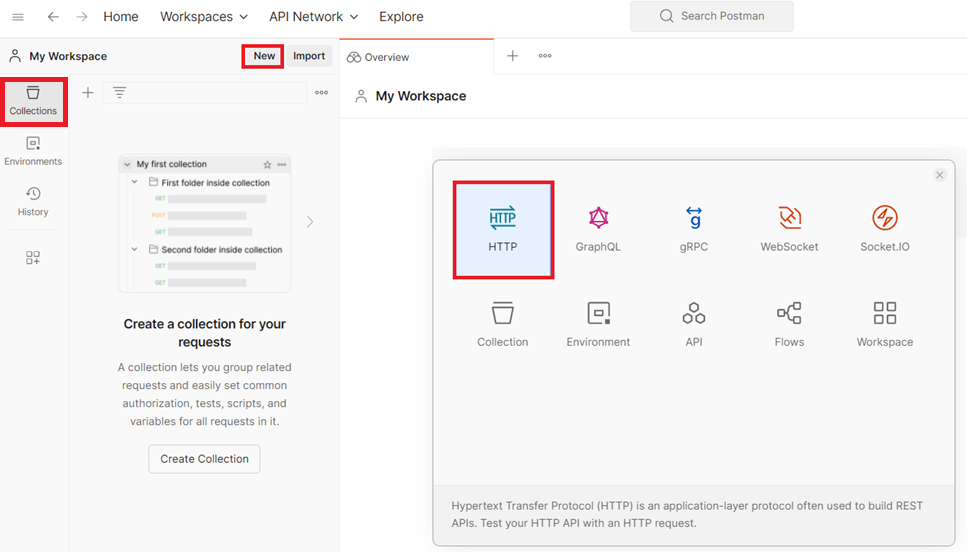

8.  Enter the details below for the new Request.

> ***Note***
>
> *Within the URL, be sure to replace **YOUR_TENANT_ID** with the Tenant
> ID you copied earlier.*

[TABLE]

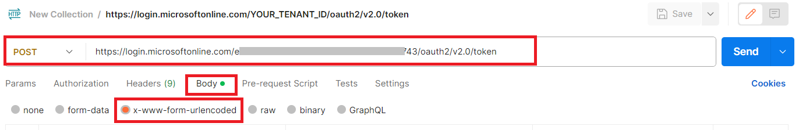

9.  Navigate to **Body**, select **x-wwww-form-urlencoded** and provide
    the following key value pairs.

[TABLE]

10. Once HTTP request is ready, click **Send**.

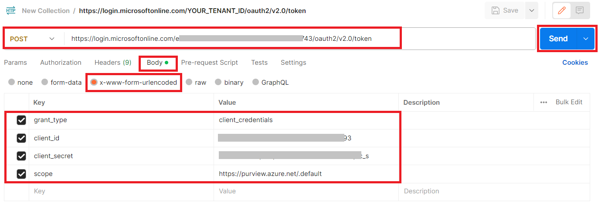

11. If successful, the response will contain an **access token**, copy
    this value for later use.

## Task 6: Read data from Microsoft Purview

1.  Within the Azure portal, open the **Microsoft Purview account**,
    navigate to **Properties** and find the **Atlas
    endpoint**. **Copy** this value for later use.

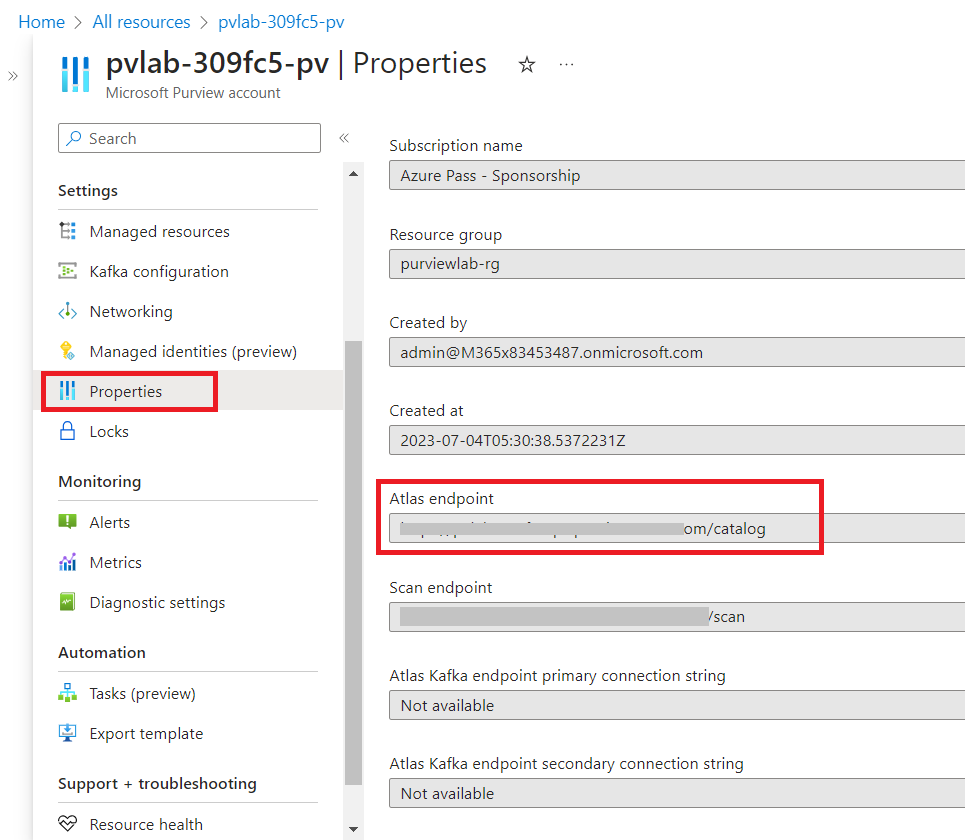

2.  On the **Postman Desktop App**, create a new **HTTP request**.

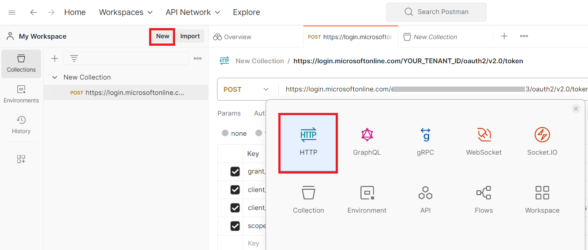

3.  Enter the following on the **HTTP Request**.

    - **HTTP Method** - GET

    - **URL** - Paste the copied **Atlas endpoint** **value** into the
      **URL** field.
      (e.g. https://YOUR_PURVIEW_ACCOUNT.purview.azure.com/catalog)

    - Add the following at the end of the URL to complete the endpoint:
      /api/atlas/v2/types/typedefs

> *Your URL should be like -
> https://YOUR_PURVIEW_ACCOUNT.purview.azure.com/catalog/api/atlas/v2/types/typedefs*
>
> ***Note***
>
> *Calling this particular endpoint will result in the bulk retrieval of
> all **type definitions**.*

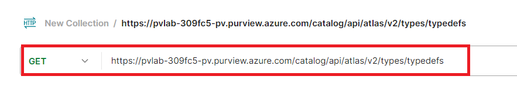

> Navigate to **Headers**, provide the following key value pair,
> click **Send**.

[TABLE]

> ***Note***
>
> *You generated an access_token in the previous request. Copy and paste
> this value. Ensure to include the "Bearer " prefix.*

4.  If successful, Postman should return a **JSON document** in the body
    of the response.

5.  Click on the **magnifying glass** and search for the following
    phrase **"name": "azure_sql_table"** to jump down to the entity
    definition for an **Azure SQL Table**.

## Task 7 - Clean up Resource

1.  Once all the Labs are completed, we can remove the resource.

2.  Click on the **Portal Menu**, then select **Resource groups**.

> 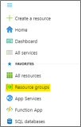

3.  Select the **Purviewlab** resource group.

> 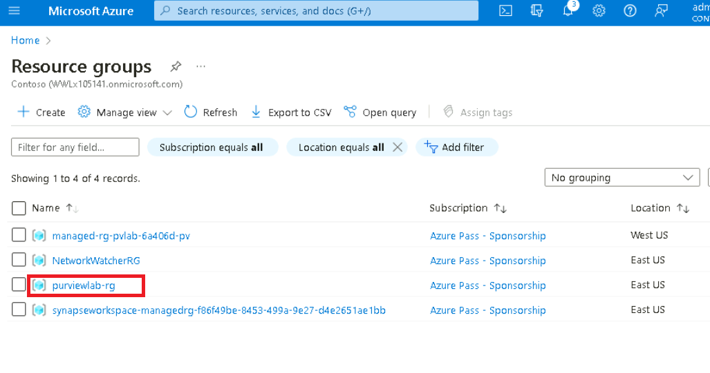

4.  Click on **Delete resource group**.

> 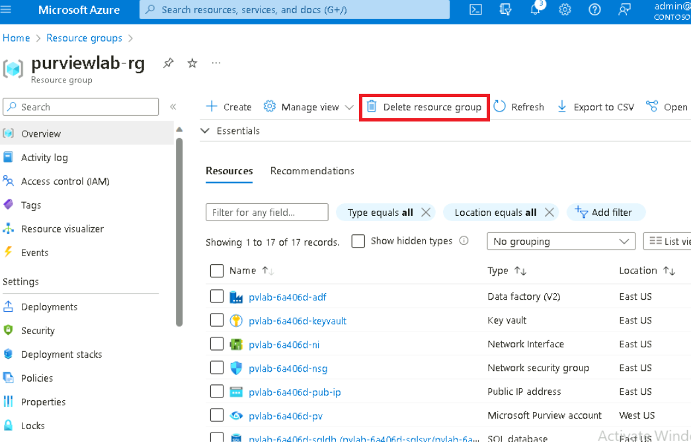

5.  Type the name of the Resource group and then click on
    the **Delete** button.

> 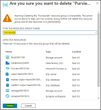

6.  You should get notification as shown in below image.

> 
