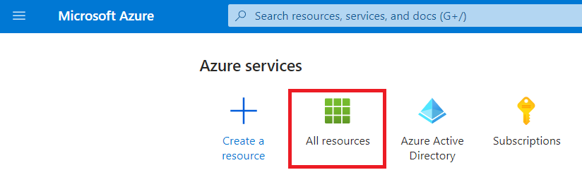
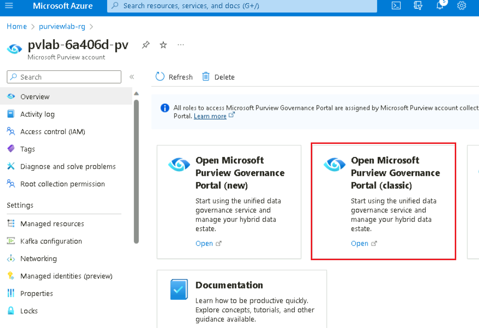
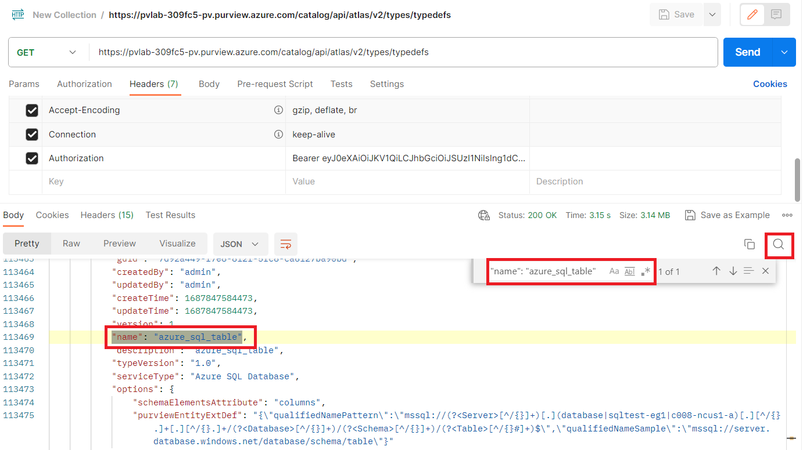

# Lab 9 – Using Microsoft Purview REST APIs

### **Task 1: Download and Install Postman**

1.  Open a new tab and browse to the **Postman** 
    !!https://www.postman.com/downloads/!! downloads link on the Lab VM
    browser and click on **Windows 64-bit**.

    

2.  Click on **Open file** to launch the installer.

    
 
    

3.  Once the App is running, click on **Skip and go to the App**.

     

## Task 2: Register an Application

To invoke the REST API, we must first register an application (i.e.
service principal) that will act as the identity that the Microsoft
Purview platform reognizes and is configured to trust.

1.  Sign in to the **Azure portal**, select the left **Menu** button,
    navigate to **Microsoft Entra ID**

      

2.  On the **Microsoft Entra ID** select **App registrations** and
    click **+ New registration**.

      

3.  Provide the application a **name**, select an **account type**, and
    click **Register**.

    |Property|	Example Value|
    |---|---|
    |Name|	purview-spn|
    |Account Type	|Accounts in this organizational directory only - Single tenant|
    |Redirect URI (optional)|	Leave blank|

    

4.  **Copy** the following values for later use.

    - Application (client) ID

    - Directory (tenant) ID

    

## Task 3: Generate a Client Secret

1.  Navigate to **Certifications & secrets** and click **+ New client
    secret**.

    

2.  Provide the following values and click **Add**.

    |Property	|Example Value|
    |---|---|
    |Description	|purview-api|
    |Expires|	180 Days|

     

3.  **Copy** the client secret value for later use.

     

## Task 4: Provide Service Principal Access to Microsoft Purview

1.  Navigate to the **Home** tab of Azure portal and select **All
    resources**.

     

2.  Navigate to the **Microsoft Purview Account** *pvlab-{RandomId}-pv*.

     

3.  Open the **Microsoft Purview Governance Portal**.

     

4.  Navigate to the **Data map** \> **Domains** \> **pvlab-{RandomId}-pv
    \> Role assignment**, and then click on the icon of **Add data
    curators**.

     

5.  Search for the name of the Service Principal **purview-spn**, select
    the Service Principal from the search results, and then
    click **OK**.

    

## Task 5: Get an Access Token

1.  Open a new tab on your browser and browse to the **Postman Web App**
    with the given link !!https://identity.getpostman.com/login!!.

2.  Select **Create account**.

     

3.  Create a new account on **Postman Web App** with your **Admin Tenant** credentials.

4.  Save the **Username** and **Password** for future use.

     

5.  witch back to the **Postman** app launched in Task 1,**Sign-In**
    with your **Username** and **Password**. Complete the
    **Authorization process**.

      

6.  Open **Postman Desktop App**, click on **Workspaces** and then
    select **My Workspace**.

      

7.  On your workspace go to **Collections** and create a new **HTTP
    request**.

    

8.  Enter the details below for the new Request.

   **Note**:Within the URL, be sure to replace **YOUR_TENANT_ID** with the Tenant ID you copied earlier.
    |Property|	Value|
    |----|----|
    |HTTP Method|	POST|
    |URL|	https://login.microsoftonline.com/YOUR_TENANT_ID/oauth2/v2.0/token|
    |Body Type|	x-wwww-form-urlencoded|
    

9.  Navigate to **Body**, select **x-wwww-form-urlencoded** and provide
    the following key value pairs.

    |Form Key|	Form Value|
    |----|---|
    |grant_type|	client_credentials|
    |client_id|	YOUR_CLIENT_ID|
    |client_secret|	YOUR_CLIENT_SECRET_VALUE|
    |scope|	https://purview.azure.net/.default|

10. Once HTTP request is ready, click **Send**.

     

11. If successful, the response will contain an **access token**, copy
    this value for later use.

     

## Task 6: Read data from Microsoft Purview

1.  Within the Azure portal, open the **Microsoft Purview account**,
    navigate to **Properties** and find the **Atlas
    endpoint**. **Copy** this value for later use.

     

2.  On the **Postman Desktop App**, create a new **HTTP request**.

     

3.  Enter the following on the **HTTP Request**.

     - **HTTP Method** - GET

    - **URL** - Paste the copied **Atlas endpoint** **value** into the **URL** field.
       (e.g. https://YOUR_PURVIEW_ACCOUNT.purview.azure.com/catalog)

    - Add the following at the end of the URL to complete the endpoint:
      /api/atlas/v2/types/typedefs

   Your URL should be like -https://YOUR_PURVIEW_ACCOUNT.purview.azure.com/catalog/api/atlas/v2/types/typedefs*
   **Note**:Calling this particular endpoint will result in the bulk retrieval of all **type definitions**.

   

  Navigate to **Headers**, provide the following key value pair, click **Send**.

    |Header Key|	Header Value|
    |---|---|
    |Authorization|	Bearer YOUR_ACCESS_TOKEN|

  **Note**:You generated an access_token in the previous request. Copy and paste this value. Ensure to include the "Bearer " prefix.
      

4.  If successful, Postman should return a **JSON document** in the body
    of the response.

     

5.  Click on the **magnifying glass** and search for the following
    phrase **"name": "azure_sql_table"** to jump down to the entity
    definition for an **Azure SQL Table**.

     

